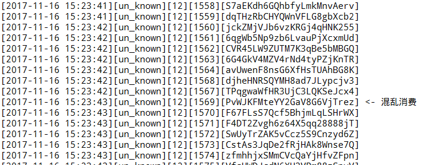
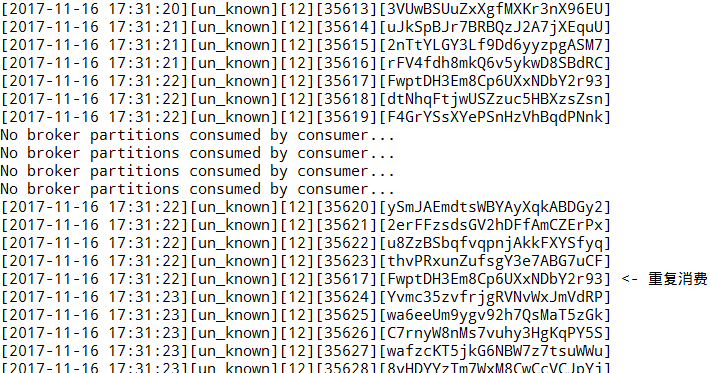

% 微服务日志管理技术概述

# 微服务日志管理技术概述

## 日志管理系统概述

## 微服务云平台

随着信息技术的发展，各行各业都在试图通过信息化来提高企业的工作效率。在此过程中，越来越多的企业业务被信息化，成为互联网上的一种服务。企业级应用程序通常由三个部分组成：一个客户界面（也称UI（User interface）由用户机器上的浏览器中的HTML页面和javscript代码或者是专用的客户端软件组合而成），一个数据库，以及一个服务端应用程序。这个服务端应用程序处理HTTP请求，运行逻辑，从数据库获取和更新数据，然后生成合适的HTML返回给用户的浏览器。这个服务器端的应用程序就是单块应用（monolithic application）——一个包含了企业应用所需全部逻辑的单一程序。任何对这个系统的改动都需要完全地重新构建和部署一个服务器端应用程序的新版本。
单块应用以其部署简洁，易于使用的优势在早期被绝大多数的企业所采用。然而，随着业务数量的增加和复杂度的提高，单块应用的问题渐渐显露出来。一方面，企业应用越来越臃肿，任何一点改动都会牵一发而动全身。哪怕仅仅是一个小小的修改都会使得整个应用需要被重新构建和部署。而不断膨胀的应用又使得重新构建和部署的成本变得越来越高，有时甚至需要在部署新版本的应用时暂停服务，这对许多企业来说是不可接受的。另一方面如果要实现对应用的横向扩展——通过启动更多的应用实例来提高性能，则需要扩展整个应用程序而不是应用中的某个部分，这将会造成资源的浪费。

随着虚拟化和云计算技术的发展，单块应用的缺点进一步显露了出来。无论是以Amazon Web Service，IBM Bluemix和Microsoft Azure 为代表的的公有云平台还是以OpenStack为代表的私有云解决方案，他们能够提供的大多是生命周期短（相对于生命周期以年计算的物理服务器），性能有限，稳定性欠佳，基于x86架构的虚拟机。巨大的单块企业应用在这样的环境下往往显得水土不服。

单块应用的这些不足催生了微服务风格应用架构：多个松耦合的服务（称为微服务）相互协作来构建应用程序。每一个服务运行在自己独立的进程中，微服务之间使用轻量的方法，通常是HTTP API来实现通信。各个服务能够独立地被部署和缩放，对应用的更改只会影响到一个微服务。通过灰度更新的方式，企业应用可以实现真正的在线升级。通过各个微服务自身的横向扩展，企业应用可以实现在稳定性不足的设备上的高可用和对资源的高效利用。各个微服务甚至可以采用不同的编程语言编写，由不同的团队来管理。
当前企业应用已经开始向着微服务架构演进，如何构建起一个合适的微服务平台以承载微服务化的应用已成为当前急需解决的问题。

### MSCP平台

MSCP平台是XXX公司正在开发的一套用于开发，部署，运维微服务化企业应用的私有云平台。该平台应当能为企业应用微服务化提供便利，能提高企业应用的开发，部署，运维的效率，提高企业应用的健壮性。为企业节省成本，帮助企业更好地实现信息化。

该系统具备以下能力：

* 支持15-20个节点（300-450应用）
* 全自动化部署
* 不同维度的自动弹性扩展
* 高度自动化运维
* 用户权限控制，数据隔离

MSCP平台基于kubernetes系统构建，可以运行在物理服务器，虚拟机，IaaS平台等各种基础平台之上。为了实现上述功能，我们的MSCP平台提供了以下的功能。

微服务运行基础架构：微服务化的应用需要一个合适的环境来运行，大量异构的微服务需要共享有限的物理资源从而实现对资源的最大化利用。而同时各个服务之间又需要适当的隔离以保护用户的数据隐私。为了实现这样的需求，我们通过虚拟化技术来为微服务提供基础环境。

应用编排系统：在微服务架构中，企业应用由大量的微服务构成。应用编排系统通常包括容器管理、调度、集群定义和服务发现等。通过容器编排引擎，容器被有机的组合成微服务应用，实现业务需求。

分布式存储：分布式文件系统是一种实际数据资源的物理存储资源不一定直接存在于节点节点上，而是分布在许多不同设备上，通过高速网络与节点相连。分布式存储利用分布式技术将多个服务器上的本地磁盘，固态存储等存储介质等组织成一个大规模资源池。同时，对上层的虚拟机和应用提供工业界标准的块存储和对象存储访问接口。在容器化微服务平台上，有状态的应用依赖分布式存储实现状态和数据的持久化以及容器间的数据共享。

网络虚拟化：网络虚拟化是一种重要的网络技术，该技术可在对物理网络进行重新分配，从而使得处于不同网络内无法互相通信的节点能相互连通或者是在不同用户之间实现网络隔离，给各个用户提供独立的网络资源切片，从而提高网络资源的利用效率，实现“有弹性的网络”。

DevOps平台：随着软件发布迭代的频率越来越高，传统的「瀑布型」（开发—测试—发布）模式已经不能满足快速交付的需求。2009 年左右被称为 DevOps 的新的模式应运而生。DevOps将开发，测试，运维的流程优化，运用大量的自动化工具将开发和运维一体化。通过CI/CD使得软件构建、测试、发布更加快捷、频繁和可靠。我们的微服务平台将提供帮助企业实施DevOps的工具。

监控系统：为了方便用户对平台和应用的性能和资源使用进行监控，本平台设计了监控系统。监控系统将会不断收集来自于各个容器，应用以及底层基础设施的性能数据。该系统将对用户提供HTTP API，以方便用户将其与分析工具或其他现有系统集成。

日志系统：日志是用户了解应用工作状态，分析故障原因。该系统提供了对日志收集，分发，储存，分析，提取的端到端的解决方案并可以进一步地和数据挖掘服务对接。从而帮助客户迅速定位问题，分析故障。

本文中介绍的便是其中的日志系统部分。

### MSCP平台日志特点和需求

日志系统的数据源是来自于MSCP平台上部署的用户应用docker容器内部各各种日志信息，加上MSCP平台自身的日志数据，通过日志收集组件对这些数据源进行信息采集，收集到的日志信息主要提供了实际生产和测试系统中的各种日志文本。同时第三方应用可以接受以组织成JSON文档的key-value的形式向日志系统通过HTTP API推送自定义的日志数据。日志系统要能够对大规模的日志数据进 行解析，并按字段进行检索，持久化到存储系统中。 

## 日志管理平台

日志是计算机系统同维护人员以及开发人员交流的重要途径。特别是对于现代互联网应用系统来说，每小时产出数以万计的日志。这些日志中记录了对系统操作大量一般或是异常信息，比如系统工作过程中的关键的操作记录，软硬件错误或是异常信息，用户对系统更改的操作记录等。这些信息不仅仅给开发，运维人员提供了维护的依据，更能够挖掘出如用户特征，行为习惯，关注热点等诸多更深层次的信息。可以说，现代信息系统的日志是企业用户的数据金矿。日志管理就是通过对不同来源的日志统一收集，处理，储存，展示，方便用户从中提取有用的信息。

目前，在市面上已经有了许多开源或是商业的日志管理解决方案，每一个系统管理员也都会有自己管理日志的独特方案。最简单的，系统管理员可以通过shell，python等脚本语言过滤，处理和分析，利用Linux系统自身的特性管理日志数据的生命周期。这种简单有效的方式得到了许多开发者和管理员的青睐。但是这种简单的方式有着显而易见的局限性，那就是只能处理部署在单个服务器上个的单个应用产生的日志。对于微服务化应用产生的高度分散的日志无法有效地处理。当然，目前亦有许多成熟的日志分析工具，如Awstats，Webalizer等等就是专门为分析日志而生的。同时，百度，谷歌等公司亦提供了一些在线工具可以用于对日志的分析。但是这些工具虽然拥有出众的分析能力但是却无法和我们的微服务平台相集成，同时由于这些工具都无法实现集群化部署，其性能无法满足微服务云平台的需求。另外，在信息安全越来越受重视的当下，企业用户并不愿意将包含有自己业务信息的日志上传到公用服务器上进行处理。面对部署在由数百台服务器构成的微服务平台上，短生命周期的数以千计的微服务产生的每秒万条以上的日志，以及企业级应用对日志管理的特殊需求，这些传统的解决方案都已难以满足需求。

对日志分析应用来说，其处理的数据规模十分庞大。在这个移动互联网高速发展的时代，数据的规模高速扩张，一个应用可能要服务于数以万计的用户，而一个终端用户可能在一天内进行数十次交易，单单一次交易便能够生成数十条日志记录。这样的服务只能由运行在云平台上的微服务化的应用来实现。

在云平台上的应用数量众多种类各异，不仅要求运行日志管理服务拥有可靠的日志存储能力，同时还要能够高性能地接受来自分布式应用的日志数据。此外，用户往往还要求云平台的日志管理服务能够提供一定的日志分析和报警功能。这些日志数据直接来自于用户应用，起结构往往只有应用开发者自己能够理解，从而无法被有效地保存到传统的结构化数据库中，我们的日志系统需要将这些非结构化的数据尽可能地保存下来。为了满足这些需求，我们的日志系统应当能够实现如下的特性：

* 对用户应用零入侵
* 通用的应用程序接口（api）
* 覆盖常见日志形式的日志收集器
* 允许用户自行开发日志收集组件并且接入我们云服务系统
* 用户，租户间数据隔离
* 高效的数据查询和过滤接口，同时和至少和某一种流行的查询方式相兼容
* 日志服务能够实现分散部署，高可用，可扩展
* 多数据中心的数据能够统一查询
* 日志数据能够提供热备份

### Elastic stack

Elastic stack是Elastic公司以ElasticSearch全文搜索引擎为核心打造的由一系列软件工具构成的数据分析系统。由于该系统中最重要的三个部分是Elasticsearch，Logstash以及Kibana所以该系统也曾被称为ELK Stack。后来Elastic 团队收购了 Packetbeat 团队，就建立了 Beat，Beat 是一个轻量级的数据收集平台，可以将不同的数据发送 ELK 系统，例如日志、网络数据、系统信息等等。Elastic 团队在命名时最终将 ELK + Beat 命名为 Elastic Stack，并将整个产品线的版本提升至 5.0。

Elastic Stack中最重要最核心的部分是ElasticSearch。ElasticSearch是Elastic公司开发的基于Apache Lucene的开源搜索引擎服务器软件。它一方面可以作为一个拥有良好的写入性能的NoSQL数据库使用，另一方面拥有第一无二的强大的近似的实时全文搜索和分析能力。这样的能力使得用户能够对海量的数据进行复杂的查询。经过清洗的数据在被输送到ElasticScarch中后，Elasticsearch会对这些数据建立索引，根据配置将数据分发到不同的分片上。同时，Elasticsearch也会对这些分片建立副本以降低结点失效时数据丢失的风险。这些分片和分片的副本会被平衡地分配到不同的数据节点上，从而降低了单节点的压力。这样的设计也为集群的建立提供了可能。当系统压力增加时，只需要将新的数据节点加入集群。整个集群的的性能便能够通过横向扩展几乎无限地扩张。

Logstash 是开源的服务器端数据处理管道，能够同时从多个来源采集数据、转换数据，然后将数据发送到包含ElasticSearch，mangoDB，kafka等在内的多种数据后端中，多个logstash亦可串联使用从而实现更为复杂的数据处理过程。数据往往以各种各样的形式，或分散或集中地存在于很多系统中。Logstash 支持各种输入选择，可以在同一时间从众多常用来源捕捉事件。能够以连续的流式传输方式，轻松地从各种服务采集数据。 数据从源传输到存储库的过程中，Logstash 过滤器能够解析各个事件，识别已命名的字段以构建结构，并将它们转换成通用格式，以便更轻松、更快速地分析和实现商业价值。 

Beats平台集合了多种单一用途数据采集器。这些采集器安装后可用作轻量型代理，从成百上千或成千上万台机器向Logstash或 Elasticsearch发送数据。Beats是数据采集的得力工具，它们能够把数据汇总到 Elasticsearch。如果需要更加强大的处理性能，Beats 还能将数据输送到 Logstash 进行转换和解析。 各种不同的Beats收集器都是以用于转发数据的通用库 libbeat 为基石。Beats社区提供了多种不同用途的收集器如用于收集日志文件的FileBeat，用于收集来自于Journald的日志数据的JournalBeat以及用于收集网络数据的PacketBeat等。

### kubernetes

kubernetes是Google开发的基于golang开发的容器化应用编排和管理工具。其可以实现在跨主机的环境上的应用编排，部署，弹性扩展，负载均衡等等一系列的功能。同时，这些这个kubernetes集群都可以通过restful的API来实现管理和使用。
kubernetes实现了以下功能：

1. 利用对容器化的应用进行包装，实例化以及运行。支持从公用和私有服务器上下载image。
2. 对容器化应用集群进行管理，实现了容器之间跨主机的网络互联互通。
3. 实现了对kubernetes集群内的资源的管理。可以通过配置资源需求限制容器使用的资源，同时自动地根据可用资源将workload分配到各个计算节点上。
4. 通过对服务(Service)的定义，实现了服务发现，负载均衡以及服务依赖管理。从而实现了对服务的生命周期管理以及对服务的调度。
5. kubernetes会自动管理应用的健康状态，当应用发生意外退出时可以将其自动重新部署，以保持应用的可用性。
6. 支持多种多样的基础平台，可以在AWS，IBM Cloud等云计算平台上工作，也可以直接部署在物理机上。
7. 提供各种监控接口，可供用户接入自己的监控平台。

kubernetes的设计思想在于维护应用集群始终处于用户计划的状态。它建立了一套完整的机制提供了对应用的全生命周期管理。

Pod在kubernetes中是最小的可以部署单元，每一个Pod都可以包含一个或多个containers。这些containre一般是同一个应用的组成部分，他们相互依赖共同提供同一服务。Pod的设计思想是想在contaltier的环境中模拟出一个抽象的逻辑主机。pod中的 各个containers运行在同一计算节点上，同一个pod里的contianer共享同一组volumes，同一个network namespace/IP和以及port space。同一个pod里的contianers可以通过locaihost互相访问。kubernetes在调度任务时，会将Pod作为一个整体来考虑。kubernetes会考虑这个节点是否拥有足够的资源来提供给整个pod从而避免免资源不足。当一个pod所在的计算节点掉线pod会被调度到新的节点。

Service是一个pod服务池的代理抽像，由于pods是短生命周期的对象，其有动态性给服务访问带来了困难。因此kubernetes提供了代理抽象的概念service, pods的访问由service代理，对外部透明。目前的实现方法是通过一个固定的虚拟IP来定义，然后通过各个计算节点上的IPtable规则来将服务请求传递给各个真正提供服务的Pod。

每个Node都会运行一个kube-proxy服务, kube-proxy会持续访问kubernetes api以获取service的新动态，每一个pod建立时都会有一组自定义的labels，同时向kubernetes master进行注册，记录相关的信息。kube-proxy会将本地运行的容器的label和service的设置进行比较。从而维护用于数据包转发的iptaible规则。 

Replication Controllers可以保证任意时刻都有指定数量提供同样服务的pods在运行， pods可运行在不同的物理主机上，当pod的数量少于指定值，会自动创建pods,否则删除多出来的pods. Replication Controllers保证了服务的高可用性。Replication Controllers同时还拥有以下功能： 

1. Rescheduling，确保指定数目的pods副本运行。当副本不足或者原本的计算节点失效时安排，在可用的计算节点上安排新的pod。
2. Scalinit，可实现pods副木的水平扩展。 
3. Rolling updates，当应用容器的镜像需要更新时kubernetes会根据配置在不停机的情况下完成应用的更新工作。

### kafka

 Kafka是由Linkedin开源的一种高吞吐量的分布式发布订阅消息系统，它可以处理消费者规模的网站中的所有动作流数据。其设计目标是高性能地Append写日志，存取的代价为O(1),直sendfile系统调用持久化文件，绕过多次内存的数据进出, 可以在普通的服务器上支持每秒万条数量的消息持久化。 
Kafka专注于大吞吐的消息队列，另外一个著名的消息队列RabbitMQ，专注于消息传递的事务性保障．一般用于实现高可靠性的消息系统，RabbitMQ与Kafka的区别如下表所示：

|                 | RabbitMQ     | Kafka             |
|-----------------|--------------|-------------------|
| Language        | Erlang       | Scala             |
| Implementation  | AMQP model   | Basic MQ          |
| Producer/Broker | Push         | Push              |
| Broker/Consumer | Push         | Pull              |
| Availability    | Mirror queue | Multiple replicas |
| Parallelism     | Multi queues | Partitions        |
| CAP             | AP/CP        | CA                |
| Throughput      | Low          | High              |

Kafka和RabbitMQ的consumer消费消息的方式不一样，Kafka是pull的方式，可以大大减轻Kafka服务器的压力，Kafka的吞吐量远远超过了RabbitMQ。

Kafka是根据topic进行消息分类，Kafka为了实现对同一个topic的消息读写的高吞吐性能，对消息进行分区存储如下图所示。并行读写提高性能。 

一个topic保存在多个partitions上，来突破单机磁盘文件尺寸的限制，有效的提升系统的并发读写能力。
 
Kafka的消息日志文件会根据broker中的配置保留一定时间后删除，到达规定期限后，无论日志是否被消费，文件都会被清除，Kafka通过过期日志清理策略来释放磁盘空间。Kalka集群的Producer和consumer的状态信息都由zooKeeper保存，这样可以使组件解耦，ZooKeeper的高可用性保证了Kafka集群的高可用性。 

当前很多消息队列服务提供可靠交付保证（RabbitMQ等），默认是即时消费，不适合离线。Kafka系统的设计目标是高吞吐，不是高可靠性，但并不代表Kafka不可靠，只是使用场景上不同。 

Kafka并不是消费一条消息就确认一条消息，简化了消息确认过程，以此来达到高 
吞吐的目的。下图展示Kafka消费消息不是严格按照时间顺序到达。 

客户端在消费Kafka的时候，如果中问过程中与Kafka集群的网络出现了中断，在重启消费数据的时候有可能会重复消费之间己经消费过的数据，这是kafka采取的at-least-one delivery的策略所造成的，kafka仅保证一条消息至少被消费一次。当consumer掉线后，有些消息可能会被重复delivery。下图展示了在断开重连的情况下消息的重复消费。

Kafka通过协调组件ZooKeeper维护集群状态和消息读写的偏移值，不存在单点故障。满足分布式系统的要求。

## 本章小结

本章主要对日志管理系统的技术背景和重要技术进行了详细介绍，包括微服务云平台的基本概念，MSCP平台的基本知识，MSCP平台上日志数据的特点。并对系统中用到的主要技术如Elastic stack，kafka和kubernetes等进行了说明。

