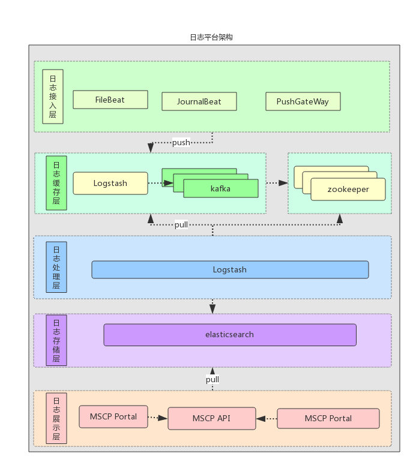
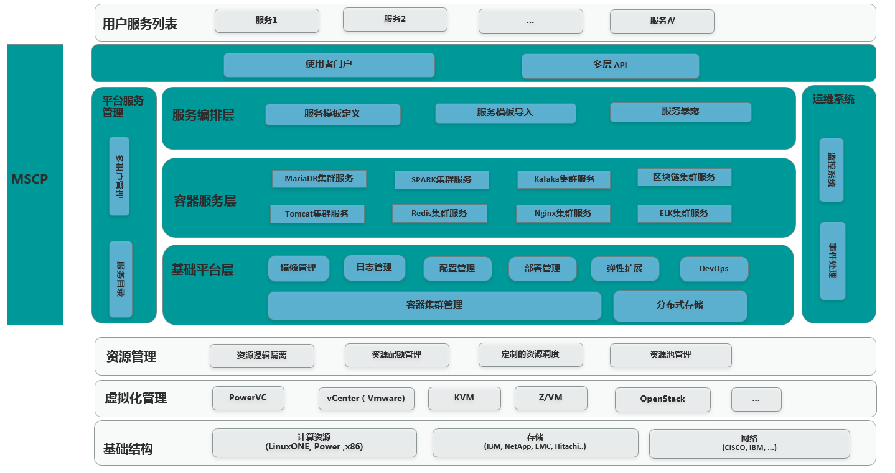
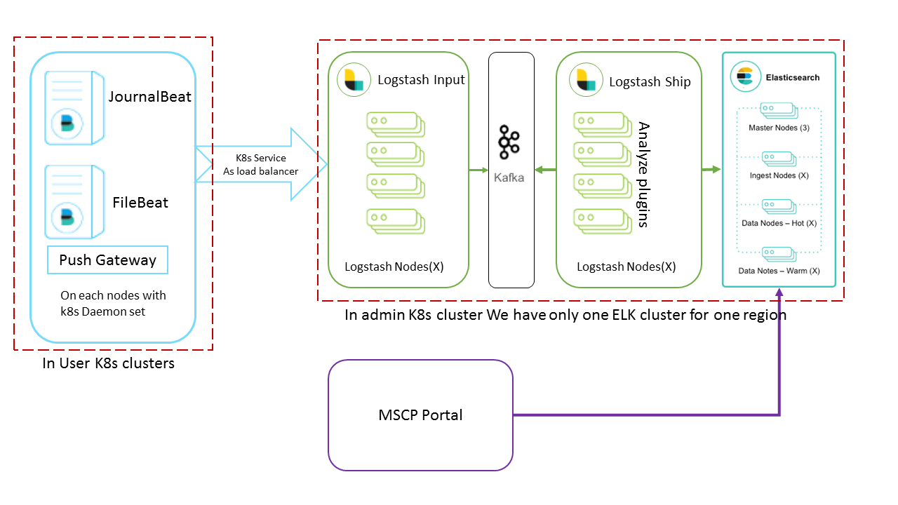
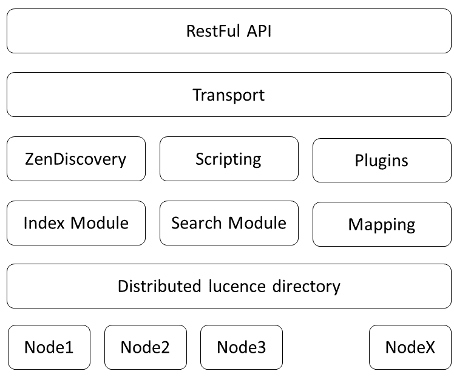
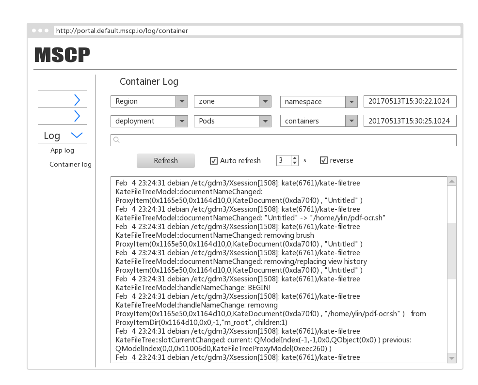
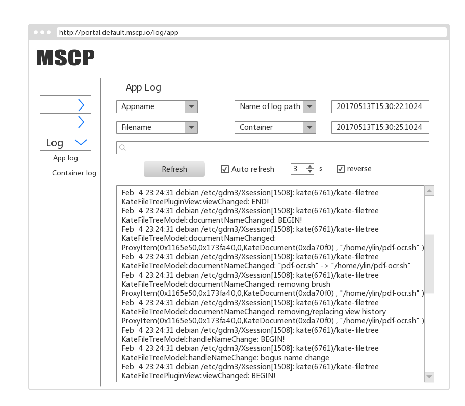
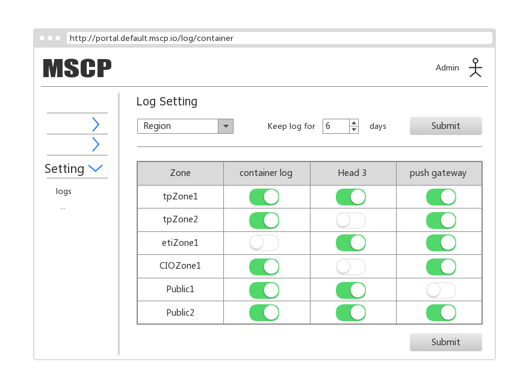

% 日志系统设计

# 日志系统设计

## 需求分析

本系统的设计需求主要是在MSCP云服务平台的实际生产中提出的统一处理各微服务日志的需求。结合当前十分流行的Elastic技术栈，在kubernetes平台上，结合kafka等技术。搭建一个高可用，高性能的日志管理平台，从而统一管理部署在MSCP平台上的各种应用产生的服务。完成对各个应用的日志数据的收集、整理、汇总、检索等工作，同时方便用户对日志数据的进一步处理。

日志系统的数据源是来自于MSCP平台上部署的用户应用docker容器内部各各种日志信息，加上MSCP平台自身的日志数据，通过日志收集组件对这些数据源进行信息采集，收集到的日志信息主要提供了实际生产和测试系统中的各种日志文本。同时第三方应用可以接受以组织成JSON文档的key-value的形式向日志系统通过HTTP API推送自定义的日志数据。日志系统能够对大规模的日志数据进 行解析，并按字段进行检索，持久化到存储系统中。 

ElasticSearch技术栈中的各个部分均能够在kubernetes集群之上实现良好的扩展性，和高可用性。通过ElustkSearch来对所有日志进行解析处理，将所有数据进行规范化。通过开放的API来实现对历史记录的总结和回溯，对第三方日志分析系统提供接入手段。提供用户友好的UI方便用户对日志数据的查询。

### 日志系统特性 

日志系统有以下特性：

* 系统各个组件之间实现松耦合，用户自身的应用程序和日志收集，日志存储，日志分析之间解耦。
* 对用户应用零入侵。
* 扩展性，支持迅速调整节点数量以实现水平扩展。同时能够实现根据负载情况自动调整系统规模。
* 高可用，集群化部署。少数几个的节点的失效不会造成整个集群服务的中断也不会造成数据丢失。
* 高性能，高并发，低延时地接受和查询日志支持全文检索。
* 提供Rest风格的API接口
* 提供用户友好的UI

### 分布式日志系统处理流程 

日志按来源分为三个不同种类，来自容器内部stdout/stderro的容器日志，来自容器内部日志文件的应用日志，和来自Http API的应用日志，用户可在此基础上结合自己的应用的部署情况和日志记录时间对日志进行过滤检索。

日志的处理流程如下：

* 应用主动将日志通过日志推送API传输到日志系统中，或者本日志系统之中的收集组件也能够主动地收集应用本地的日志，然后同步到日志系统中。
* 日志系统将数据落盘到数据库中。
* 日志系统需要提供日志查询的接口。 

### 分布式日志系统功能需求和性能需求 

日志系统的功能需求：

* 能够零入侵地收集容器内的日志数据。
* 拥有高性能的日志写入、读取API。
* 提供日志的查询以及日志系统管理的API接口。同时兼容ElasticSearch的查询语法。
* UI上提供日志按照时间正序查询以及逆序直询接口，并支持全文检索。
* 实现应用和应用之间，租户和租户之间的数据隔离并兼容MSCP系统的Role based access control模型。 

分布式日志系统的性能需求：

* 在单region支持12krps以上的日志落盘能力。
* 单region支持TB级的数据的存储能力。
* 查询平均在5秒以内完成，简单查询在2秒以内完成。
* 日志落盘延时在10秒以内。在region间实现无限水平扩展。

## 日志系统总体架构设计

日志系统架构如下图所示：

* 数据收集组件：日志收集器，HTTP Restful API接口
* 数据清洗组件：logstash分析器
* 数据缓存组件：高速消息队列缓存kafka
* 数据存储组件：ElasticSearch
* 数据查询和集群管理组件：数据查询和集群管理API Server
* 前端UI

数据收集组件从docker容器内部收集包括stdout/stderr，日志文件等在内的日志数据，并且开放HTTP API接口以供用户应用直接推送日志数据。该API接口能够通过分析数据来源自动将这些数据归入某用户名下从而实现数据隔离。logstash分析器对来自各个数据源的数据进行清洗，删除一些不需要的字段，同时对数据来源作分析，形成半结构化的数据，传递给高速缓存kafka。由于logstash作为无状态的服务，可以几乎无限地水平扩展，其性能往往远远超过ElasticSearch落盘的性能。Kafka高速缓存可以有效地将到达的数据缓存起来，等待ElasticSearch空闲时再将数据落盘。这样的设计一方面挡住了高并发的访问减少了日志数据落盘时的阻塞，另一方面有效地利用了ElasticSearch的性能。作为MSCP平台API接口的一部分，日志服务也提供了restful的API接口，通过该接口能够查询和管理日志服务的状态，同时其查询接口兼容ElasticSearch查询语法。这个API接口也能够和MSCP云平台的role based access control相配合有效地对用户数据进行隔离。在MSCP前端页面上我们提供了一个前端页面，用户可以方便地通过这个页面查询自己应用的日志；管理员用户还可以管理和查询日志服务的状态。下面详细说明各个组件的设计方案。

## 日志系统云平台层设计

MSCP微服务云平台的整体架构如下图所示

在MSCP平台上，每个zone对应着一个kubernetes集群，这个集群一般被安置在同一个服务器机房的内部；而同一个region中的各个不同zone一般部署在同一个数据中心内部，其间一般由高速网络相连接（一般有多个千兆网络）。而region一般对应用户部署在不同地理位置上的数据中心，如用户的北京数据中心，纽约数据中心等等。其间一般通过公用网络相连接，这些链接一般容量不足，同时价格昂贵，无法支持大量日志数据的传输需求。针对以上情况我们对日志系统在云平台上的部署作了如下图的规划：

每个region拥有自己的ElasticSearch数据库和kafka集群，这些集群与MSCP平台的其他基础组件一同作为一些deployment被安装在一个被称为Admin zone的kubernetes集群之中。用户无法在此zone中部署自己的应用。这样的设计保证了MSCP平台的稳定性和用户体验。同一个region中的日志收集器和分析器均将数据发送到region中的ElasticSearch中。

而日志收集组件由于需要部署到kubernetes中的每一台计算节点上。所以作为DaemonSet被部署到每一个kubernetes集群之中。

而日志查询API Server作为MSCP平台API Server的一部分能够根据用户查询的不同从不同的数据源中查询日志数据。

日志前端UI亦作为MSCP UI的一部分，与其一同部署。

## 日志系统各组件设计

下面介绍日志系统各个组件的设计。

### 数据收集组件

日志收集组件主要由两个部分构成，日志文件收集器和HTTP API接口。

日志收集器收集docker容器中的应用发送到控制台以及日志文件中的日志。这也是应用最常见的日志记录方式。通过这种方式收集日志不需要用户对自己的应用作出任何更改，做到了对用户应用的零入侵。对于容器化应用来说，其最佳实践是将所有日志发送到控制台，所以这些来自控制台的日志实际也是日志数据中最重要的部分。对于这部分日志我们将其重定向到系统中的journald服务之中，然后通过部署在每一台计算节点上的journalbeat收集器统一发送到日志服务之中。

另外，传统上应用开发者一般会选择将各种不同的日志，如服务器日志，系统日志，业务日志等输出到不同的日志文件之中保存到服务器本地。对于这一部分日志我们将其挂载到容器外部，从而暴露给负责收集日志文件的filebeat收集器，完成收集工作。

此外我们还提供了一个HTTP API接口以供愿意修改自己应用，或者是有特殊需求的用户使用。用户可以直接通过这个API向我们的日志系统推送日志数据。这个API充分考虑到了用户自定义日志数据结构的需求。用户除了可以向我们的系统提交日志文本和时间戳等必须的信息职位，还可以以key-value的方式描述一些自定义的字段，从而大大增强了日志系统可以接受的数据的描述能力。

考虑到HTTP协议是一个比较“重”的协议，其链接建立，断开以及头部都需要消耗额外的资源，通过这样的协议传输如而日志数据这样的段数据会造成数据传输效率低下的问题，我们的HTTP API还提供了批量写入的功能。一个HTTP请求可以包含多组日志数据。

### 数据清洗组件

该组件主要负责对日志的数据进行清洗，为了能够在云服务平台上实现用户间的数据隔离并且保证用户查询的结果真实可信，我们通过建立Logstash服务（在日志系统中被称为phaser）对日志数据进行加工处理。来自于不同源头的日志数据会由不同的phaser服务进行处理，通过对特定字段进行切分，类型转换，字段重命名等操作，原始的来源不同的日志数据被统一转换为符合设计结构的数据项。同时这个过程中，一些对日志系统来说价值较低或者重复的数据项目，如在有微秒级时间戳和毫秒级时间戳的情况下我们仅保留微秒级时间戳，而诸如系统版本，进程ID，进程优先级等字段在这个过程中将被删除。而对于来自API Server的日志数据来说，数据清洗组件也能够过滤掉不符合系统要求的日志存储请求。这一过程降低了ElasticSearch需要分析和持久化的数据量，从结果上提高了系统的性能。在完成数据清洗之后，该组件将会将日志数据传递给数据缓存组件。

### 数据缓存组件

日志数据通常是短文本数据，其尺寸一般很小，通常有效数据不会超过1KiB。而在一个生产系统上用户应用每秒就可能产生数以千计的日志数据。这样的业务特点要求我们的数据缓存组件能够拥有很高的数据吞吐和处理并发请求的能力。Apache Kafka是由Java和Scala编写的开源流处理平台。它提供了一个统一，高吞吐量，低延迟平台来处理实时数据流。它十分适合用于实现一个大规模，可扩展的消息队列。我们将其集成到日志系统之中并通过第二个logstash服务（在日志系统中被称为shipper）将kafka中缓存的数据“运输”到ElasticSearch之中。

### 数据存储组件

数据存储组件主要由ElasticSearch数据库实现，这也是本系统中最为核心的部分。ElasticSearch是Elastic公司开发的基于Apache Lucene的开源搜索引擎服务器软件。它一方面可以作为一个拥有良好的写入性能的NoSQL数据库使用，另一方面拥有第一无二的强大的近似的实时全文搜索和分析能力。这样的能力使得用户能够对海量的数据进行复杂的查询。经过清洗的数据在被shipper服务输送到ElasticScarch中后，Elasticsearch会对这些数据建立索引，根据配置将数据分发到不同的分片上。同时，Elasticsearch也会对这些分片建立副本以降低结点失效时数据丢失的风险。这些分片和分片的副本会被平衡地分配到不同的数据节点上，从而降低了单节点的压力。这样的设计也为集群的建立提供了可能。当系统压力增加时，只需要将新的数据节点加入集群。整个集群的的性能便能够通过横向扩展几乎无限地扩张。

日志系统默认按日期建立索引，对于每天产生的新的数据利用当天日期取名。为了降低单个索引的压力，来自于各个不同主机的日志也会被安置到不同的索引之中。由于ElasticSearch对内存占用相当大，需要部署ElasticSearch的节点有较高的性能。为了不让ElasticSearch集群影响到用户应用的正常工作，我们选择将其部署到一个单独的Kubernetes集群之中。针对集群管理的需求，我们选择了自己开发自动伸缩工具来管理集群规模。同时利用一些第三方工具来实现对日志数据的冷热分离机制。当有ElasticSearch节点失效时，集群会自行利用副本中的数据来恢复改节点上的内容，同时将负载分配给其他节点，从而保证了节点失效不会造成数据丢失，这一特性在集群收缩过程中也扮演着重要角色。整个ElasticSearch集群内部架构如下图所示，用户的日志数据被分配到了集群中的各个节点中。在查询数据时，ElasticSearch集群将查询请求分配给相关数据所在的数据节点，这些节点分别进行查询统计，最后由主节点完成汇总将结果返回给用户。

### 数据查询组件

日志系统提供Http API接口以供用户接入自己的日志分析系统。从而使得应用的开发人员可以集中精力于其业务逻辑而将日志分析的任务交给专业团队。同时MSCP前端UI对日志的访问也需要通过该接口获取数据。该API同MSCP平台的其他API一样是基于Http的Rest风格API。为了减少用户的学习成本，同时兼容一些现有的分析工具。日志查询API直接采用了ElasticSearch的查询语法和返回格式。

为了提供对第三方系统的集成能力，MSCP平台的API直接暴露在公网之上。为了保护用户的隐私和数据的安全，日志系统需要提供一定的鉴权方式和加密手段来验证客户端身份。由于MSCP平台的API Server会被分布式部署，如果使用传统的基于cookie-session方案，则cookie内仅包含一个session标识符，而诸如用户信息、授权信息等都保存在服务端的数据库中。用户每次访问时服务端都需要查询数据库来确定用户身份。应用实例之间无法直接共享用户状态。针对这一问题，我们选择了利用JWT token机制实现用户鉴权。用户信息直接包含在此token之中，MSCP平台在签发token时使用一个secretkey对这些用户信息进行数字签名。客户端在每一次向服务器发送请求时都会把这个token作为一个请求参数随同请求数据一同发送给服务器。服务器在收到请求时会然后通过验证数字签名的有效性来验证token。token短期有效，从而降低了token遗失带来的安全隐患，也提高了对抗“回放攻击”的能力。

此外日志系统也为管理员用户提供了查询日志系统状态和更改日志系统设置的能力。
该组件使用Go语言基于BeeGo框架实现。

### 前端UI
日志系统的前端UI作为MSCP系统前端UI的一部分实现。这个UI是一个基于AngularJS实现的单页应用。该应用通过Http API和后台进行交互，交换所需数据。日志查询UI由两部分构成，一是容器日志，负责显示容器中stdout/stderro中的日志信息。二是应用日志，负责显示用户自定义的日志文件和通过Http API推送的日志信息。用户按照自己的需求，按Region，Zone，Namespace，App查询自己部署的应用日志。

页面设计如下图所示：

另一方面，管理员用户可以访问一个日志系统管理页面，从而查询自己的管理的kubernetes集群中日志系统的运行状态。并对日志系统进行一些设置。

页面设计如下图所示：

<!-- ## (架构对比分析) -->
<!-- Optional -->
## 本章小结

本章主要完成了MSCP平台上的日志系统的总体设计工作，包括需求分析、在云平台上的部署架构设计、日志系统自身架构和各个模块的等的设计。首先阐述整个系统的设计目标和需要成的工作。完成了整体的架构设计，在此基础之上，将整个系统分为了一下6个组件数据收集组件、数据清洗组件、数据缓存组件、数据存储组件、数据查询和集群管理组件、前端UI。将6大组件分别进行了设计，为实际的系统实现提供了架构依据。 

