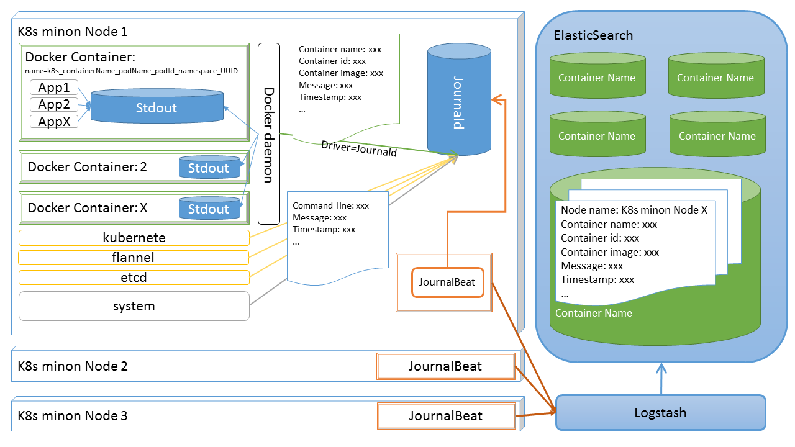
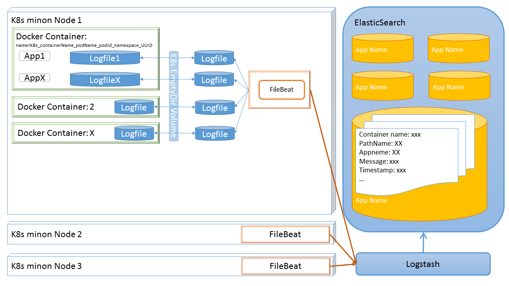

#日志系统设计
##用户鉴权的实现
由于后面日志收集API，日志查询API都需要用到用户鉴权所以我们在此首先介绍我们的用户鉴权的实现。
##数据收集组件的实现
本组件主要包括三部分，第一部分是基于journald和JournalBeat对容器内控制台数据的收集的实现。第二部分是基于FileBeat对容器内日志文件的收集的实现。第三部分是日志推送接口的实现。
### 容器控制台日志的收集
容器内日志控制台日志的收集过程如下图所示：

为了让docker能给将容器中控制台中的日志数据发送到journald。首先需要对kubernetes计算节点上运行的docker service进行设置。修改，docker service的定义文件，在我们基于centos7.2的计算节点上该文件是`/etc/systemd/system/docker.service`
在docker的启动参数中加入或者修改参数`--log-driver`的值为`journald`然后通过`systemctl restart docker.service`重启docker守护程序，以使配置生效。
docker容器发送到journald中的数据可以通过journalctl程序读出，journalctl支持将日志数据组织成json形式输出，其典型结构如下（与本日志系统关联不大的字段已被删除）：
```
{
  "__CURSOR": "s=d8478c3862d347e59d28104ba4edb24d;i=144dd0;b=b4d5f19eb0fa4460a1155cdb19fcdcf9;m=f1125097aa;t=54f14690b9edf;x=19866ec227042b69",
  "__REALTIME_TIMESTAMP": "1494323963862751",
  "__MONOTONIC_TIMESTAMP": "1035394389930",
  "_HOSTNAME": "kvm-009660.novalocal",
  "MESSAGE": "2017-05-09 09:59:23.854320 I | flags: recognized and used environment variable   "CONTAINER_NAME": "k8s_kube-controller-manager.905f3855_kube-controller-manager-kvm-009660_kube-system_7cc96a847ece6fad70a98b9db56bd08d_01130b8b",
  "_SOURCE_REALTIME_TIMESTAMP": "1494323963855249",
  ...
}
```
<!-- Here we don't known if those item that we don't need can be covered. -->
其中`MESSAGE`字段是应用实际提交的日志信息，`__CURSOR`字段是一个对日志条目的唯一标记，该标记可以用于在日志存储中定位日志，该字段对帮助日志收集器确定收集数据的起点有重要作用。`CONTAINER_NAME`字段提供容器名称。其中由kubernetes管理的应用的名称一般包含了关于日志来源的信息如容器所属的pod，deployment，namespace的名称等。我们将利用这些信息来确定日志来源，为日志入库归档提供依据。`_REALTIME_TIMESTAMP`字段记录了日志数据被journald接收到的时间点。这是一个微秒级的时间戳，标识了自UNIX纪元（1970-01-01 00:00:00 UTC）开始已经过的微秒数。根据linux man7的解释，这个时间点一般略晚于由应用自己汇报的日志产生时间`_SOURCE_REALTIME_TIMESTAMP`。但是其优势在于，首先这个数值由journald直接生成不会被用户应用“欺骗”，其次其有更好的唯一性，比较不容易出现诸如两条日志拥有同样的时间戳的情况。我们选择这一字段作为日志排序的主要依据。`_HOSTNAME`字段提供了日志文件来源的计算节点名称，这一信息将用于决定日志数据在ElasticSearch中的存储位置。
由于日志数据主要在ElasticSearch中存储，journald中存储的数据可以尽量少。我们对journald进行一些额外的配置，以使得journald中的数据在达到一定数量的情况下能够自动滚动删除。journald的配置文件`/etc/systemd/journald.conf`中的重要配置如下：
```
[Journal]
Storage=volatile     #为了提高系统性能，日志数据保存在内存中
SystemMaxUse=1G      #日志最多占用1GiB的空间
SystemKeepFree=4G    #至少为其他应用保留4GiB空间
MaxRetentionSec=7day #最多保留7天的日志数据
```
在日志数据到达宿主机内部的journald之后我们使用一个被称为JournalBeat的工具将journald中的内容收集起来然后发送给数据清洗组件logstash，logstash的地址会以环境变量的形式被配置到JournalBeat容器内部。JournalBeat作为一个daemonSet被部署在每一个kubernetes集群之中。就结果上来说每一个计算节点都会部署上一个JournalBeat实例。
JournalBeat的重要配置如下：
```
journalbeat:
  #保存的日志日志坐标处开始收集
  seek_position: cursor  
  #如果没有找到保存的坐标则从尾部开始收集，这一般发生在第一次部署时
  cursor_seek_fallback: tail 
  #保存日志位置坐标
  write_cursor_state: true 
  cursor_state_file: /data/journalbeat-cursor-state
  cursor_flush_period: 5s
  clean_field_names: true
  convert_to_numbers: true
  move_metadata_to_field: journal
name: journalbeat
#进行一些预处理，只保留来自docker容器的日志，和感兴趣的字段
processors:
- drop_event:
    when:
      not:
        regexp:
          journal.container_name: "^.+"
- include_fields:
    fields: [ "journal.container_name",
              "journal.hostname",
              "journal.container_id",
              "journal.realtime_timestamp",
              "message",
              "@metadata"
            ]
output.logstash:
  enabled: true
  hosts: ["${LOGSTASH_HOST}"]
logging.level: info
```
JournalBeat在kubernetes集群上的定义如下（仅重要部分）：
```
apiVersion: extensions/v1beta1
kind: DaemonSet
spec:
    ...
    spec:
      containers:
      - env:
        - name: LOGSTASH_HOST
          value: #Logstash服务的地址和监听端口
        image:  [dockerReg]/journalbeat-container
        name: journalbeat-container
        #为了能够访问带宿主机上的日志数据我们需要将一系列的路径挂载到容器内部。
        volumeMounts:
        - mountPath: /var/log/journal
          name: var-journal
          readOnly: true
        - mountPath: /run/log/journal
          name: run-journal
          readOnly: true
        - mountPath: /etc/machine-id
          name: machine-id
          readOnly: true
        - mountPath: /data/
          name: data
        - mountPath: /journalbeat.yml
          name: config
          subPath: journalbeat.yml
      volumes:
      - hostPath:
          path: /var/journalBeatContainerData
        name: data
      - hostPath:
          path: /var/log/journal
        name: var-journal
      - hostPath:
          path: /run/log/journal
        name: run-journal
      - hostPath:
          path: /etc/machine-id
        name: machine-id
      #通过configMap将配置文件提供给journalBeat
      - configMap:
          defaultMode: 420
          items:
          - key: journalbeat.yml
            path: journalbeat.yml
          name: journalbeat-container-config
        name: config
```
### 容器内日志文件的收集
容器内日志文件的收集过程如下图所示：

为了能够收集到容器内部的日志文件中的日志数据我们需要将容器内部的日志挂载到容器外，从而让用于收集日志文件的FileBeat工具能够完成对其的访问。同时，在容器消亡后这些日志文件需要一同被回收。用户如果需要使用该功能则在MSCP平台上部署应用时需要在编排应用的阶段，设置日志文件所在的位置。MSCP日志系统将会收集所有位于该位置下的*.log文件。

如以下代码所示，在编排应用的过程中MSCP平台将会，建立一个名为`applog-[serviceUUID]-endname-[logDirName]`的空目录。通过这个名称中包含的信息，我们能够建立起主机上的日志目录与用户应用间的联系。
```
//golang
//Compose empty dir for log collecting
func composeLogEmptyDir(appInfo *Service) (volumes []k8model.Volume) {
	if !(len(appInfo.LogDirList) > 0) {
		return nil
	}
	logDirList := appInfo.LogDirList
	for key := range logDirList {
		volume := new(k8model.Volume)
		logDir := logDirList[key]
		volume.Name = fmt.Sprintf("applog-%s-endname-%s", appInfo.ServiceUUID, logDir.Name)
		volume.EmptyDir.Medium = "{}"
		volumes[key] = *volume
	}
	return volumes
}
```
用户需要提供该日志目录的标题和路径。MSCP系统在部署该应用时会利用kubernetes的`EmptyDir`存储类型将容器内部的目录和主机上的一个空目录建立联系。kubernetes中的`EmptyDir`是一个空目录，他的生命周期和所属的Pod是完全一致的。在Pod被建立起来的同时，kubernetes会在宿主机的`/var/lib/kubelet/pods/[containerUUID]/volumes/kubernetes.io~empty-dir/`建立一个名字和`EmptyDir`的名字相同的目录，然后将这个目录挂载进容器内部。在容器被销毁时，主机上的这个目录也会同时被销毁。由于`EmptyDir`一定是一个空目录，所以用户应当注意应为日志数据单独建立一个目录来进行操作而不能与其他数据或程序混杂在同一目录之中。
在每一台宿主机上我们都会通过部署`FileBeat`组件来收集这些日志文件。`FileBeat`是elastic stack生态圈的一部分，它可以收集来自日志文件的日志数据，同时发送到下一级进行下一步的处理。同`JournalBeat`一样这些`FileBeat`组件也是作为`DaemonSet`部署在kubernetes集群上的。这些`FileBeat`实例的重要配置如下：
```
filebeat.prospectors:
- input_type: log
  paths:
    - /k8spods/*/volumes/kubernetes.io~empty-dir/applog-*/*.log
output.logstash:
  hosts: ["${LOGSTASH_HOST}"]
output.file:
  path: "/tmp/filebeat"
  filename: filebeat
```
他们将会收集`/k8spods/*/volumes/kubernetes.io~empty-dir/applog-*/`目录下的所有`.log`文件中的日志数据，然后将其发送到指定的`logstash`中进行处理。FileBeat在kubernetes集群上的定义如下（仅重要部分）：
```
apiVersion: extensions/v1beta1
kind: DaemonSet
spec:
  template:
    spec:
      containers:
      - env:
        - name: LOGSTASH_HOST
          value: [LOGSTASH_HOST]
        image:  [dockerReg]/filebeat-app:[version]
        name: filebeat-app
        volumeMounts:
        - mountPath: /k8spods/
          name: k8spods
          readOnly: true
      volumes:
      - hostPath:
          path: /var/lib/kubelet/pods/
        name: k8spods
```
### 日志推送接口

##数据清洗组件

##数据缓存组件

##数据存储组件

##数据查询和集群管理组件

##前端UI