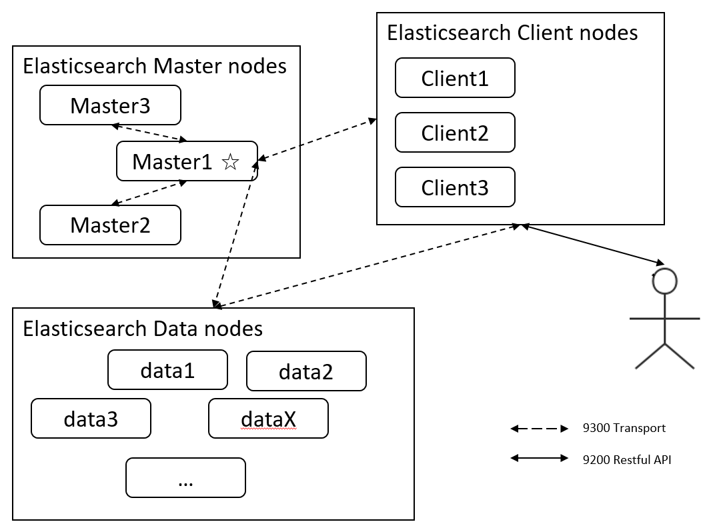
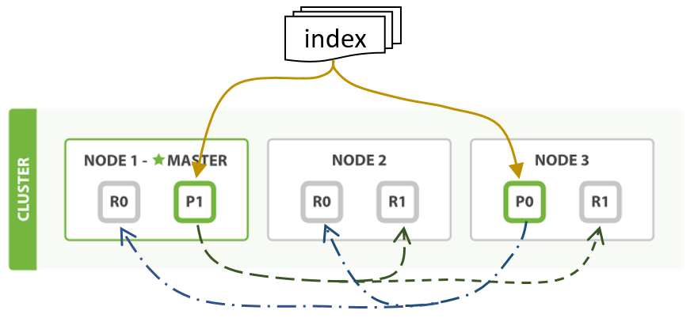
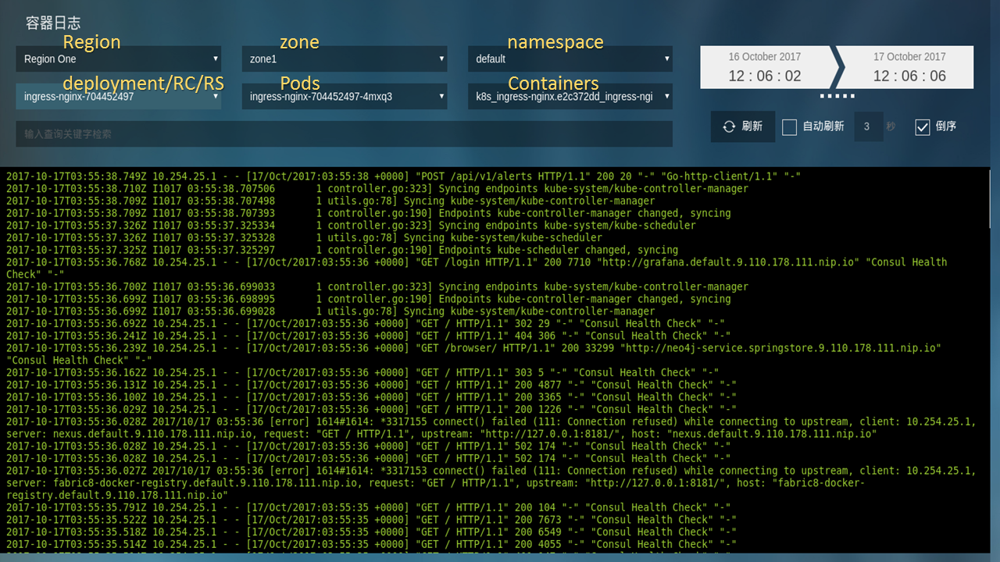
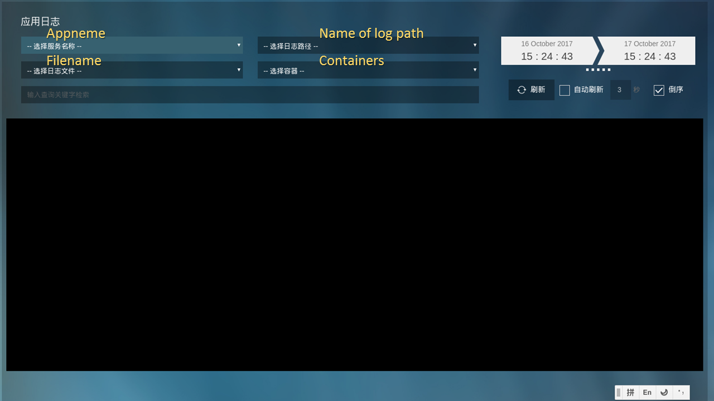

#日志系统设计
##用户鉴权的实现
由于后面日志收集API，日志查询API都需要用到用户鉴权所以我们在此首先介绍我们的用户鉴权的实现。MSCP平台上的用户鉴权机制通过基于jwt的令牌机制来实现。JSON Web Token（JWT）是一个非常轻巧的规范。一个JWT实际上就是一个字符串，它经过Base64编码的头部、载荷与签名三部分组成。
载荷是jwt中最重要的部分，用户的信息都保存在载荷之中。MSCP平台上的jwt载荷（Payload）一般与如下所示的json文本的结构相同：
```
{
  "iat": 1516792419,
  "exp": 1548334419,
  "user_id": "12203",
  "email": "linyzbj@cn.linyz.net",
  "role": ["cloud","tenant","user"],
  "access": [
    {
      "method": ["GET","POST","DELETE",...],
      "url":["[mscp_api_url]/[region]/system/log",...],
      "other":{}
    },...
  ]
}
```
其中最重要的是以下字段：
* exp(expires): 什么时候过期，这里是一个Unix时间戳；
* iat(issued at): 签发时间戳(UNIX时间)；
* user_id: 用户id
* role: 用户角色数组，包含了用户的扮演的所有角色
* access: 该token所授权的资源信息，下文中会具体介绍。
这个载荷会经过Base64编码，成为jwt的第一部分，下文称编码1。
jwt令牌还需要一个头部，这个头部被用于描述关于该JWT的基本信息，例如其类型以及签名算法等。这也被表示成一个JSON文档。
```
{
  "typ": "JWT",
  "alg": "HS256"
}
```
这个头部指明了，这个请求通过JWT鉴权，签名算法是HS256算法。JWT一般可以选择使用非对称的RSA或者对称的HMAC算法对token签名。MSCP系统选择使用HMAC算法来进行签名。这是一种对称加密，加密密钥与解密密钥相同，其优点在于计算量较小。缺点在于无法支持第三方签发token的场景。但是MSCP系统上的token都由MSCP API自己签发，所以HMAC算法即可以满足需求。这个头部经过Base64编码，成为jwt的第二部分，下文称编码2。
MSCP系统在签发token时会使用来自数据库中的一组密钥，通过HMAC-SHA256算法来对上文中编码1和编码2用句号`.`连接在一起（头部在前）形成的形如`编码2.编码1`的字符串通过加密和哈希来进行签名，这个签名下文中称为编码3。此密钥由系统自行生成，并且会经常更改以降低泄露风险。
最后将这一部分签名也拼接在被签名的字符串后面，我们就得到了完整的JWT，形如`编码2.编码1。编码3`
这一组信息会在在HTTP头部的`Authorization`字段或者直接在请求URL的`jwt`参数中被传输。我们一般推荐用户将这部分数据作为HTTP头部发送，以避免出现url过长的问题。API Server在收到请求后会通过验证签名来验证token的有效性。
MSCP平台中的用户在第一次使用API或者是当前token已经过期的情况下需要访问`GET [mscp_api_url]/auth/token_root`，API使用自己的邮箱和密码通过`basic`认证方式来获取一个自己的根token。这个根token不包含任何的`access`信息，只包含用户的基本信息。之后，用户若要访问其他API则需要使用根token来访问`GET [mscp_api_url]/auth`API接口并在请求体中加入需要访问的API的信息，也就是上文中的`access`字段内容来申请实际用于访问API的token。
其中`method`指的是HTTP方法，`url`是API的路径，`other`是一个可以包含其他附加信息的结构体。MSCP API Server会在收到这个请求后通过查询数据库中的内容觉得是否签发这个token。如果申请通过则会向用户返回包含授权信息的token，否则返回401授权失败错误。
MSCP系统中的每个API都会通过检查用户提供的jwt来决定是否提供服务。
##数据收集组件的实现
本组件主要包括三部分，第一部分是基于journald和JournalBeat对容器内控制台数据的收集的实现。第二部分是基于FileBeat对容器内日志文件的收集的实现。第三部分是日志推送接口的实现。
### 容器控制台日志的收集
容器内日志控制台日志的收集过程如下图所示：

为了让docker能给将容器中控制台中的日志数据发送到journald。首先需要对kubernetes计算节点上运行的docker service进行设置。修改，docker service的定义文件，在我们基于centos7.2的计算节点上该文件是`/etc/systemd/system/docker.service`
在docker的启动参数中加入或者修改参数`--log-driver`的值为`journald`然后通过`systemctl restart docker.service`重启docker守护程序，以使配置生效。
docker容器发送到journald中的数据可以通过journalctl程序读出，journalctl支持将日志数据组织成json形式输出，其典型结构如下（与本日志系统关联不大的字段已被删除）：
```
{
  "__CURSOR": "s=d8478c3862d347e59d28104ba4edb24d;i=144dd0;b=b4d5f19eb0fa4460a1155cdb19fcdcf9;m=f1125097aa;t=54f14690b9edf;x=19866ec227042b69",
  "__REALTIME_TIMESTAMP": "1494323963862751",
  "__MONOTONIC_TIMESTAMP": "1035394389930",
  "_HOSTNAME": "kvm-009660.novalocal",
  "MESSAGE": "2017-05-09 09:59:23.854320 I | flags: recognized and used environment variable   "CONTAINER_NAME": "k8s_kube-controller-manager.905f3855_kube-controller-manager-kvm-009660_kube-system_7cc96a847ece6fad70a98b9db56bd08d_01130b8b",
  "_SOURCE_REALTIME_TIMESTAMP": "1494323963855249",
  ...
}
```
<!-- Here we don't known if those item that we don't need can be covered. -->
其中`MESSAGE`字段是应用实际提交的日志信息，`__CURSOR`字段是一个对日志条目的唯一标记，该标记可以用于在日志存储中定位日志，该字段对帮助日志收集器确定收集数据的起点有重要作用。`CONTAINER_NAME`字段提供容器名称。其中由kubernetes管理的应用的名称一般包含了关于日志来源的信息如容器所属的pod，deployment，namespace的名称等。我们将利用这些信息来确定日志来源，为日志入库归档提供依据。`_REALTIME_TIMESTAMP`字段记录了日志数据被journald接收到的时间点。这是一个微秒级的时间戳，标识了自UNIX纪元（1970-01-01 00:00:00 UTC）开始已经过的微秒数。根据linux man7的解释，这个时间点一般略晚于由应用自己汇报的日志产生时间`_SOURCE_REALTIME_TIMESTAMP`。但是其优势在于，首先这个数值由journald直接生成不会被用户应用“欺骗”，其次其有更好的唯一性，比较不容易出现诸如两条日志拥有同样的时间戳的情况。我们选择这一字段作为日志排序的主要依据。`_HOSTNAME`字段提供了日志文件来源的计算节点名称，这一信息将用于决定日志数据在ElasticSearch中的存储位置。
由于日志数据主要在ElasticSearch中存储，journald中存储的数据可以尽量少。我们对journald进行一些额外的配置，以使得journald中的数据在达到一定数量的情况下能够自动滚动删除。journald的配置文件`/etc/systemd/journald.conf`中的重要配置如下：
```
[Journal]
Storage=volatile     #为了提高系统性能，日志数据保存在内存中
SystemMaxUse=1G      #日志最多占用1GiB的空间
SystemKeepFree=4G    #至少为其他应用保留4GiB空间
MaxRetentionSec=7day #最多保留7天的日志数据
```
在日志数据到达宿主机内部的journald之后我们使用一个被称为JournalBeat的工具将journald中的内容收集起来然后发送给数据清洗组件logstash，logstash的地址会以环境变量的形式被配置到JournalBeat容器内部。JournalBeat作为一个daemonSet被部署在每一个kubernetes集群之中。就结果上来说每一个计算节点都会部署上一个JournalBeat实例。
JournalBeat的重要配置如下：
```
journalbeat:
  #保存的日志日志坐标处开始收集
  seek_position: cursor  
  #如果没有找到保存的坐标则从尾部开始收集，这一般发生在第一次部署时
  cursor_seek_fallback: tail 
  #保存日志位置坐标
  write_cursor_state: true 
  cursor_state_file: /data/journalbeat-cursor-state
  cursor_flush_period: 5s
  clean_field_names: true
  convert_to_numbers: true
  move_metadata_to_field: journal
name: journalbeat
#进行一些预处理，只保留来自docker容器的日志，和感兴趣的字段
processors:
- drop_event:
    when:
      not:
        regexp:
          journal.container_name: "^.+"
- include_fields:
    fields: [ "journal.container_name",
              "journal.hostname",
              "journal.container_id",
              "journal.realtime_timestamp",
              "message",
              "@metadata"
            ]
output.logstash:
  enabled: true
  hosts: ["${LOGSTASH_HOST}"]
logging.level: info
```
JournalBeat在kubernetes集群上的定义如下（仅重要部分）：
```
apiVersion: extensions/v1beta1
kind: DaemonSet
spec:
    ...
    spec:
      containers:
      - env:
        - name: LOGSTASH_HOST
          value: #Logstash服务的地址和监听端口
        image:  [dockerReg]/journalbeat-container
        name: journalbeat-container
        #为了能够访问带宿主机上的日志数据我们需要将一系列的路径挂载到容器内部。
        volumeMounts:
        - mountPath: /var/log/journal
          name: var-journal
          readOnly: true
        - mountPath: /run/log/journal
          name: run-journal
          readOnly: true
        - mountPath: /etc/machine-id
          name: machine-id
          readOnly: true
        - mountPath: /data/
          name: data
        - mountPath: /journalbeat.yml
          name: config
          subPath: journalbeat.yml
      volumes:
      - hostPath:
          path: /var/journalBeatContainerData
        name: data
      - hostPath:
          path: /var/log/journal
        name: var-journal
      - hostPath:
          path: /run/log/journal
        name: run-journal
      - hostPath:
          path: /etc/machine-id
        name: machine-id
      #通过configMap将配置文件提供给journalBeat
      - configMap:
          defaultMode: 420
          items:
          - key: journalbeat.yml
            path: journalbeat.yml
          name: journalbeat-container-config
        name: config
```
### 容器内日志文件的收集
容器内日志文件的收集过程如下图所示：

为了能够收集到容器内部的日志文件中的日志数据我们需要将容器内部的日志挂载到容器外，从而让用于收集日志文件的FileBeat工具能够完成对其的访问。同时，在容器消亡后这些日志文件需要一同被回收。用户如果需要使用该功能则在MSCP平台上部署应用时需要在编排应用的阶段，设置日志文件所在的位置。MSCP日志系统将会收集所有位于该位置下的*.log文件。

如以下代码所示，在编排应用的过程中MSCP平台将会，建立一个名为`applog-{serviceUUID}-endname-{logDirName}`的空目录。通过这个名称中包含的信息，我们能够建立起主机上的日志目录与用户应用间的联系。
```
//golang
//Compose empty dir for log collecting
func composeLogEmptyDir(appInfo *Service) (volumes []k8model.Volume) {
	if !(len(appInfo.LogDirList) > 0) {
		return nil
	}
	logDirList := appInfo.LogDirList
	for key := range logDirList {
		volume := new(k8model.Volume)
		logDir := logDirList[key]
		volume.Name = fmt.Sprintf("applog-%s-endname-%s", appInfo.ServiceUUID, logDir.Name)
		volume.EmptyDir.Medium = "{}"
		volumes[key] = *volume
	}
	return volumes
}
```
用户需要提供该日志目录的标题和路径。MSCP系统在部署该应用时会利用kubernetes的`EmptyDir`存储类型将容器内部的目录和主机上的一个空目录建立联系。kubernetes中的`EmptyDir`是一个空目录，他的生命周期和所属的Pod是完全一致的。在Pod被建立起来的同时，kubernetes会在宿主机的`/var/lib/kubelet/pods/{containerUUID}/volumes/kubernetes.io~empty-dir/`建立一个名字和`EmptyDir`的名字相同的目录，然后将这个目录挂载进容器内部。在容器被销毁时，主机上的这个目录也会同时被销毁。由于`EmptyDir`一定是一个空目录，所以用户应当注意应为日志数据单独建立一个目录来进行操作而不能与其他数据或程序混杂在同一目录之中。
在每一台宿主机上我们都会通过部署`FileBeat`组件来收集这些日志文件。`FileBeat`是elastic stack生态圈的一部分，它可以收集来自日志文件的日志数据，同时发送到下一级进行下一步的处理。同`JournalBeat`一样这些`FileBeat`组件也是作为`DaemonSet`部署在kubernetes集群上的。这些`FileBeat`实例的重要配置如下：
```
filebeat.prospectors:
- input_type: log
  paths:
    - /k8spods/*/volumes/kubernetes.io~empty-dir/applog-*/*.log
output.logstash:
  hosts: ["${LOGSTASH_HOST}"]
output.file:
  path: "/tmp/filebeat"
  filename: filebeat
```
他们将会收集`/k8spods/*/volumes/kubernetes.io~empty-dir/applog-*/`目录下的所有`.log`文件中的日志数据，然后将其发送到指定的`logstash`中进行处理。FileBeat在kubernetes集群上的定义如下（仅重要部分）：
```
apiVersion: extensions/v1beta1
kind: DaemonSet
spec:
  template:
    spec:
      containers:
      - env:
        - name: LOGSTASH_HOST
          value: [LOGSTASH_HOST]
        image:  [dockerReg]/filebeat-app:[version]
        name: filebeat-app
        volumeMounts:
        - mountPath: /k8spods/
          name: k8spods
          readOnly: true
      volumes:
      - hostPath:
          path: /var/lib/kubelet/pods/
        name: k8spods
```
### 日志推送接口
日志推送接口是一个基于beego实现的API接口，用户可以直接通过这个API向我们的日志系统推送日志数据。这个API充分考虑到了用户自定义日志数据结构的需求。用户除了可以向我们的系统提交日志文本和时间戳等必须的信息职位，还可以以key-value的方式描述一些自定义的字段，从而大大增强了日志系统可以接受的数据的描述能力。我们的HTTP API还提供了批量写入的功能。一个HTTP请求可以包含多组日志数据。
在我们的日志平台上用户向我们推送的日志数据应当有以下的数据结构：
```
[{"timestemp": 1516792419231221,
  "appid": "caa0c2f0-1116-495f-8f09-3cd023cc14a2",
  "type": "applog",
  "message":"Message to send.",
  "annotations":[
    {"key":"level", "value":"info"},...]
},...]
```
其中`timestemp`，`appid`，`type`以及`message`是必须的字段，如果这些字段有缺失，则服务器会拒绝这个请求并返回400(bad request)错误。一个请求之中可以包含多个日志数据条目。这个API接口会通过上述的jwt方式验证用户的权限。服务器会检查token中`access`字段中是否有形如
```
{
  "method": ["POST"],
  "url":["{mscp_api_url}/apps/{appid:UUID}/log"],
}
```
的记录，如果有的话则认为用户完成了鉴权过程，服务器会将这些日志记录推送入数据缓存服务然后返回202(Accepted)，否则返回403(Forbidden)错误。
##数据清洗组件
数据清洗组件主要由logstash实现，将接受来自于数据收集组件的日志数据然后推送给数据缓存组件。数据清洗组件的工作流程如下图所示：

上图中虚线框内部的是logstash进行的操作。其主要过程包含Input，Filter，Output三个关键步骤。这三个过程分别完成了从收集组件接收数据，数据处理和数据向缓存组件输出的工作。
这个数据清洗工作的核心是Filter过程，在logstash的处理过程中，filter完成了数据处理工作。其主要工作是对数据进行字段切分，合并编辑和合并等。由于接收到的JSON数据结构中许多数据字段包含有混合的信息。所以必须对数据进行字段解析，按需分切从而获取需要字段和值。同时将这些值转换成正确的类型。
在logstash中，我们利用Grok对数据字段通过正则表达式进行解析。主要是根据kubernetes的产生的`container name`进行切分从而获得`container_name`，`container_id`，`controler`，`podid`，`namespace`，`uuid`等字段。然后利用muate等工具对字段进行处理整合，从而生成其他需要的字段。
我们还会利用grok工具对`container name`进行检查，检查其是否满足kubernetes的命名规范。对于诸如`etcd`，`kubelet`等不由kubernetes管理的docker容器，他们的容器名称不符合kubernetes的命名规范。我们手工产生这些字段从而使得进入ElasticSearch的数据结构能够统一。
最后，kubernetes还会对每一个Pod产生一个`PAUSE`容器用于管理同一个pod中的多个容器。这个容器产生的日志数据对我们的系统没有意义。我们将其丢弃。
我们的日志系统在ElasticSearch中每天为来自每一个宿主机的日志数据建立一个index。这个index名字也来自于filter中获取的字段。
logstash的重要配置如下：
```
filter {
  if [journal][container_name] == "kubelet" or [journal][container_name] =~ "etcd[0-9]+" {
    grok {
      match => { "journal[container_name]" => ["(?<controler>.+)"] }
      add_field    => {
        "container" => "%{controler}"
        "podid" => "%{journal[hostname]}"
        "namespace" => "default"
        "uuid" => "00000000-0000-0000-0000-000000000000"
        "resourceid" => "00000000"
        "containerid" => "00000000"
      }
    }
    mutate {
      replace => { "journal[container_name]" => "%{journal[container_name]}_%{journal[hostname]}_%{journal[container_id]}" }
    }
  } else {
    grok { match => { "journal[container_name]" => [
        "k8s_(?<container>[a-zA-Z0-9\-]+)\.(?<containerid>[0-9a-f]{6,8})_(?<controler>[a-zA-Z0-9\-]+)-(?<podid>[a-z0-9]+)_(?<namespace>[a-zA-Z0-9\-]+)_(?<uuid>[0-9a-f]{8}-{0,1}[0-9a-f]{4}-{0,1}[0-9a-f]{4}-{0,1}[0-9a-f]{4}-{0,1}[0-9a-f]{12})_(?<resourceid>[0-9a-f]{8})"
        ] } }
  }
  # Drop event from "pause" containers 
  if [container] == "POD" {  
    drop {}  
  }  
  mutate { add_field => { "pod" => "%{controler}-%{podid}" } }
  #create index name
  mutate{ add_field => { "index" => "logstash-%{[@metadata][beat]}-%{journal[hostname]}" } }
  mutate{ lowercase => [ "index" ] }
  mutate{ gsub => [ "index", "[^a-z0-9\-_]", "_" ] }
}
```
由于数据传输速度和数据处理速度远远大于ElasticSearch落盘的速度。数据会在清洗组件形成堆积，这是我们加入数据缓存组件的根本原因。通过加入消息队列kafka我们可以在数据处理过程结束以后，logstash会将数据推送到作为数据缓存组件的kafka集群之中。从而增加对数据高峰的处理能力。
在我们的日志系统上，logstash被作为一个deployment部署在`admin zone`上，我们可以利用kubernetes来管理logstash的实例数量，从而管理数据清洗组件的性能。
##数据缓存组件
我们使用kafka来实现日志数据的缓存。Apache Kafka是由Java和Scala编写的开源流处理平台。它提供了一个统一，高吞吐量，低延迟平台来处理实时数据流。它十分适合用于实现一个大规模，可扩展的消息队列。我们将其集成到日志系统之中并通过第二个logstash服务（在日志系统中被称为shipper）将kafka中缓存的数据“运输”到ElasticSearch之中。kafka作为MSCP平台提供的开箱即用服务直接部署。
`shipper`的脚本极为简单，只是简单地将kafka中的数据搬运到Elasticsearch中：
```
input { kafka{
  bootstrap_servers => "scale-kafka-service:9092"
  topics => "logstash-journal"
  codec => "json" }
}
filter {}
output { elasticsearch {
  hosts => "http://elasticsearch.elk.svc.cluster.local:9200"
  manage_template => false
  index => "%{index}-%{+YYYY.MM.dd}"
  document_type => "%{[@metadata][type]}" }
}
```
##数据存储组件
我们的日志系统采用ElasticSearch来实现我们的数据存储组件。这个组件实际上还承担着日志检索的工作所以，实际上是我们整个日志系统的核心。ElasticSearch作为一个基于Lucene的搜索引擎，其性能优异，功能强大。其已经在实际的生产中得到了广泛的认可和应用。下图展示了ElasticSearch集群的部署架构。

ElasticSearch集群由多个ElasticSearch实例构成。每一个ElasticSearch实例都可以实现三种主要功能：作为Master节点管理集群状态，作为Data节点实现数据存储以及作为client节点提供HTTP API访问接口。一个ElasticSearch实例在集群中可以实际承担这其中的一种或多种功能。
ElasticSearch集群一般都会选择一个启用了master功能的实例作为master节点，除了该节点之外集群中的其他节点都是slave节点。其他启用master功能的ElasticSearch实例都从master节点中备份集群的信息。以备Master节点失效时恢复集群状态。站在用户的角度上来看，master节点在ElasticSearch集群中并不占据一个重要的位置。这同用户一般对其他其它系统的认识(比如传统的分布式数据库系统)不同。实际上用户要知道主节点在哪里，甚至不需要知道自己需要访问的数据在哪里；所有操作都可以被分派到任意一个节点，ElasticSearch集群内部会自动将这些请求发送到各个data节点上来完成。在必要的时候下，任何一个节点都可以并发地把查询计算workload分发到其它的节点上，然后合并来自于各个不同节点的查询结果。最后再返回给用户一个完整结果集。所有这些工作都不需要通过主节点的协调和汇总，data节点之间能够通过P2P的方式通信，自动地协调集群的工作。
在我们的日志平台上，为了实现更好的可扩展性和获得性能ElasticSearch节点都只扮演Master，Data或者Http API server中的一者。
按照ElasticSearch的默认配置，节点之间会通过多播(multicast)寻找集群中的其它节点，并与之建立连接。然而在kubernetes集群中，容器之间通过flannel虚拟网络相互通信，这种虚拟网络不支持多播通信。我们需要配置ElasticSearch集群中的节点使之通过单播的方式实现集群发现。在此过程中我们首先要建立起一个kubernetes service，这个service中包含了所有的ElasticSearch容器。下面是这个service在kubernetes中的定义：
```
apiVersion: v1
kind: Service
metadata:
  name: elasticsearch-discovery
  labels:
    component: elasticsearch
    role: master
spec:
  selector:
    component: elasticsearch
    role: master
  ports:
  - name: transport
    port: 9300
    protocol: TCP
```
ElaticSearch中的各个节点在试图通过这个service访问其他节点集群管理端口（9300）时请求会被等概率地分发到各个节点之上。节点之间会通过这一特性渐渐地相互发现。ElasticSearch集群有时会发生脑裂的问题。这是由于ElasticSearch集群启动过程中多个Master节点分别获取Data节点建立集群造成故障。常发于ElasticSearch安装部署过程中和集群发送故障后自动恢复的过程。可造成出现Log无法查询等问题。为了避免这个问题的发生，我们可以将`discovery.zen.minimum_master_nodes`的值设置到master节点数量的二分之一以上。这个参数控制的是，一个节点需要看到的具有master节点资格的最小数量，然后才能在集群中做操作。这样的设计可以保证最多只有一组节点达到足够建立集群的数量。从而在避免master过早停止节点发现过程同时也能够承受少量的节点失效。
```
    cluster.name: "elasticsearch"
    network.host: 0.0.0.0
    # discovery service name in k8s
    discovery.zen.ping.unicast.hosts: elasticsearch-discovery
    # should > nb_node/2
    discovery.zen.minimum_master_nodes: 2 
    xpack.security.enabled: false
    xpack.monitoring.enabled: false
    node.master: false      # true for master node
    node.data: false        # true for data node
    http.enabled: false     # true for HTTP API server
```
我们的系统中为了提高日志落盘性能，使用了ElasticSearch中新的MMap文件系统来存储日志数据。这种存储类型使用Apache Lucene MMapDirectory实现类。它使用linux中的mmap功能完成文件随机读写操作。它将原本直接存储到文件磁盘的文件数据映射到同样尺寸的虚拟内存空间中。由于没有涉及到任何的锁操作，在多线程共同存取数据文件时程序就具有可伸缩性了(这里可伸缩性是指当增加线程数量时，程序的处理能力相应增加)。我们使用mmap来读取索引文件时，在linux系统看来，该文件已被缓存(文件会被映射到虚拟内存中)。因此，ElasticSearch在从Lucene索引中读取文件时，数据可以直接从内存缓存中被读到，读取速度会快很多。这基本就是允许ElasticSearch直接操作I/O缓存，索引文件的读写效率会提高很多。
由于Mmap要求每一个线程都能够访问足够大的内存，这一数值受两个配置的影响。首先是JAVA Heap的大小，我们将JAVA Heap的最大和最小数值设为一致，从而JVM可以在启动时就获取做够的内存。其次linux系统的`max_map_count`参数决定了允许一个进程在VMAs(虚拟内存区域)拥有最大数量。linux发行版的`max_map_count`参数配置一般较低。我们在启动实际的ElasticSearch实例之前首先启动一个`busybox`容器来配置这个参数。
ElasticSearch在kubernetes上的定义如下：
```
apiVersion: extensions/v1beta1
kind: Deployment
spec:
  replicas: 2
  selector:
    matchLabels:
      component: elasticsearch
      role: client/master/data
  template:
    metadata:
      annotations:
        pod.beta.kubernetes.io/init-containers: '[{
            "name": "sysctl",
            "image": "busybox",
            "imagePullPolicy": "IfNotPresent",
            "command": ["sysctl", "-w", "vm.max_map_count=262144"],
            "securityContext": {"privileged": true}
          }]'
    spec:
      containers:
      - name: es-client/data/master
        securityContext:
          capabilities:
            add:
              - IPC_LOCK
        image:  [dockerReg]/elasticsearch:6.1.3
        env:
        - name: "ES_JAVA_OPTS"
          value: "-Xms2048m -Xmx2048m"
        ports: ...
        volumeMounts: ...
        - name: config
          mountPath: /usr/share/elasticsearch/config/elasticsearch.yml
          subPath: elasticsearch.yml
      volumes:
          - name: config
            configMap:
              name: elasticsearch-config
              items:
                - key: client/master/data.yml
                  path: elasticsearch.yml
```
ElasticSearch将Logstash发送过来的数据建立索引并存储起来。ElasticSearch的储存模型如下图所示：

根据上图所示，ElasticSearch中的一个索引可以被理解为传统关系型数据库中的一个数据库，所有数据都保存在这些索引之中。一个索引一般可以被分为多个分片，每一个分片都存储了索引中数据的一部分。一个分片一般有一主多副，多个副本。在默认配置下ElasticSearch之中的的一个索引被分为5个分片，这5个分片分别拥有一个副本。这样的配置可以保证在有一个数据节点失效的情况下数据不丢失。
分片会被分配到各个不同的数据节点上，上图中可以看到三个ElasticSearch节点中各有一些主分片和一些分片副本。这些分片共同构成了一个完整的索引的数据。
考虑到设备的存储能力有限，一般需要对ElasticSearch中的数据作轮转处理，定期删除集群中的旧数据。ElasticSearch中数据的删除方式一般是使用使用HTTP API对集群发出指令，如调用`DELETE '[ES_API]/old-index'`可以删除`old-index`索引。从ElasticSearch中删除索引的速度很快，一般与删除的数据量无关。日志系统中的轮转策略一般由用户定义，根据实际需求选择如何处理已经收集到的数据。在我们的日志系统中管理员用户可以配置数据存储的时间。
在我们的日志系统上ElasticSearch的数据轮转采用了curator工具，该工具主要用于对ElasticSearch中的索引进行处理，定期删除旧的索引。curator工具所用的脚本如下所示：
```
actions:
  1:
    action: delete_indices
    description: "Delete selected indices"
    options:
      timeout_override: 300
      continue_if_exception: True
    filters:
    - filtertype: pattern
      kind: regex
      value: '^logstash-journalbeat-(([a-zA-Z]|[a-zA-Z][a-zA-Z0-9\-]*[a-zA-Z0-9])\.)*([A-Za-z]|[A-Za-z][A-Za-z0-9\-]*[A-Za-z0-9])-.*$'
    - filtertype: age
      source: field_stats
      direction: older
      unit: days
      unit_count: [NUMBER_OF_DAYS_TO_DELETE]
      field: '@timestamp'
      stats_result: max_value    
```
该脚本首先通过正则表达式过滤需要删除的索引名。其中的`actions[1][filters][1][unit_count]`字段控制了数据的寿命，创建时间早于这个时间的索引将会被删除。这个值可以通过集群管理API更改。curator会通过kubernetes每天运行一次，每次运行时curator都会使用最新配置。
##数据查询和集群管理组件
数据查询和集群管理组件是一组rest风格的api，和其他的MSCP API一样，这个api通过基于jwt的用户鉴权服务完成rbac。
在完成鉴权之后查询日志的请求会被原样转发给ElasticSearch集群。然后将ElasticSearch集群的回复原样转发给用户。通过这样的操作我们的日志系统实现了查询接口以及语法和ElasticSearch相兼容。从而降低了用户的学习成本也方便了用户将自己的日志分析服务接入我们的日志系统。
我们的日志系统向管理员用户提供了查询日志系统状态和管理日志系统配置的接口。这些配置接口被安排在`[mscp_api_url]/[region]/system/log`路径下。
`GET [mscp_api_url]/[region]/system/log/status`接口提供了当前日志系统的状态，其返回的数据结构如下：
```
[{"status": "green/yellow/red",
  "timestemp": 0,
  "rotate":{
    "enabled": true,"age": 7
  }
  "collector": {
    "journalbeat": {
      "enabled": true,
      "status": {
        "scheduled": 10, "up": 10
      },
      "instances": [{"node": "string",
        "pod_id": "string","status": "up"
      }]
    },
    "filebeat": {"enabled": true,"status": {...},"instances": [...]
    },
    "http_gateway": {"enabled": true,"status": {...}}
  },
  "parser": {"status": {...}},
  "shipper": {"status": {...}},
  "kafka": {
    "health_check": true,
    "zookeeper": {"status": {...}},
    "broker": {"status": {...}}
  },
  "elasticsearch": {
    "status": {
      "master": {
        "scheduled": 3, "up": 3
      },
      "client": {...},"data": {...}
    },
    "health": {
      "cluster_name": "elasticsearch",
      "status": "green",
      "timed_out": false,
      "number_of_nodes": 12,
      "number_of_data_nodes": 10,
      "active_primary_shards": 2006,
      "active_shards": 4012,
      "relocating_shards": 0,
      "initializing_shards": 0,
      "unassigned_shards": 0,
      "delayed_unassigned_shards": 0,
      "number_of_pending_tasks": 0,
      "number_of_in_flight_fetch": 0,
      "task_max_waiting_in_queue_millis": 0,
      "active_shards_percent_as_number": 100
}}}]
```
`POST [mscp_api_url]/[region]/system/log`接口可供管理员修改日志系统的配置。用户可以将上面数据结构中的部分配置根据自己的需求进行修改，然后将这个修改过的json文档作为request body发送。用户可以通过此接口启用或停用日志轮转功能，改变ElasticSearch集群的配置，启用或停用某种日志收集器等。
##前端UI
日志系统的前端UI作为MSCP系统前端UI的一部分实现。这个UI是一个基于AngularJS实现的单页应用。该通过Http API和后台进行交互，交换所需数据。日志查询UI由两部分构成，一是容器日志，负责显示容器中stdout/stderro中的日志信息。二是应用日志，负责显示用户自定义的日志文件和通过Http API推送的日志信息。用户按照自己的需求，按Region，Zone，Namespace，App查询自己部署的应用日志。
线上部署的系统上的前端UI如下图所示：


## 本章小结
本章主要完成了MSCP平台上的日志系统的设计工作完成后的具体实现，云平台上的部署以及包括数据收集组件、数据清洗组件、数据缓存组件、数据存储组件、数据查询和集群管理组件、前端UI在内的6个组件的实现。对各个组件的实现进行了详细的阐述，综合前面介绍的关键技术，将整个系统继续搭建和集成。展示了数据收集，处理，存储，展示以及轮转的整个生命周期的过程。实际上，在真实生产环境上运行的ElasticSearch集群还有一组服务用来维持其状态，同时根据请求数量自动地改变集群规模，但是这个部分不在本文讨论范围以内。