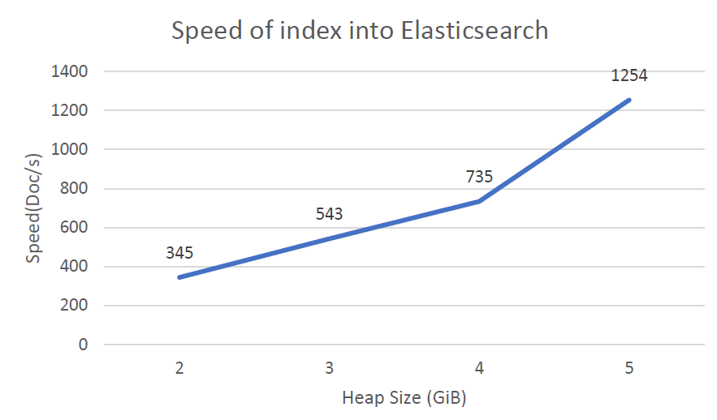
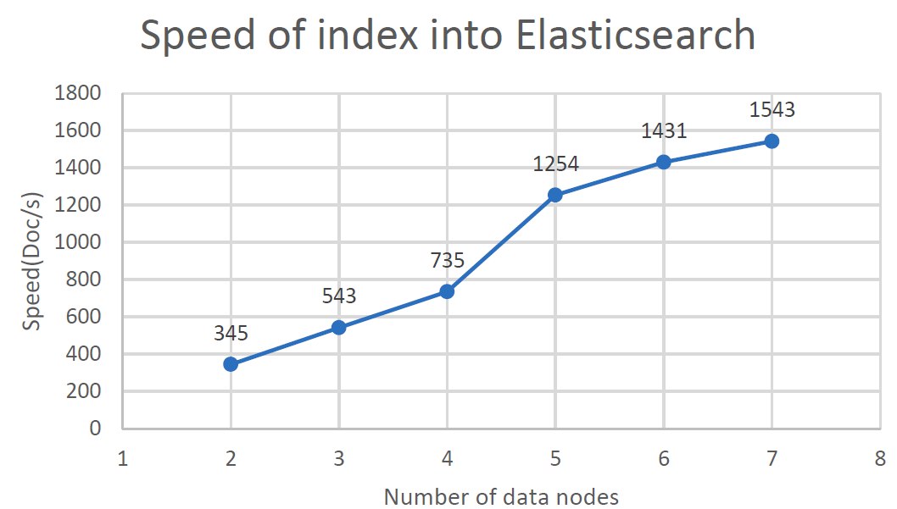
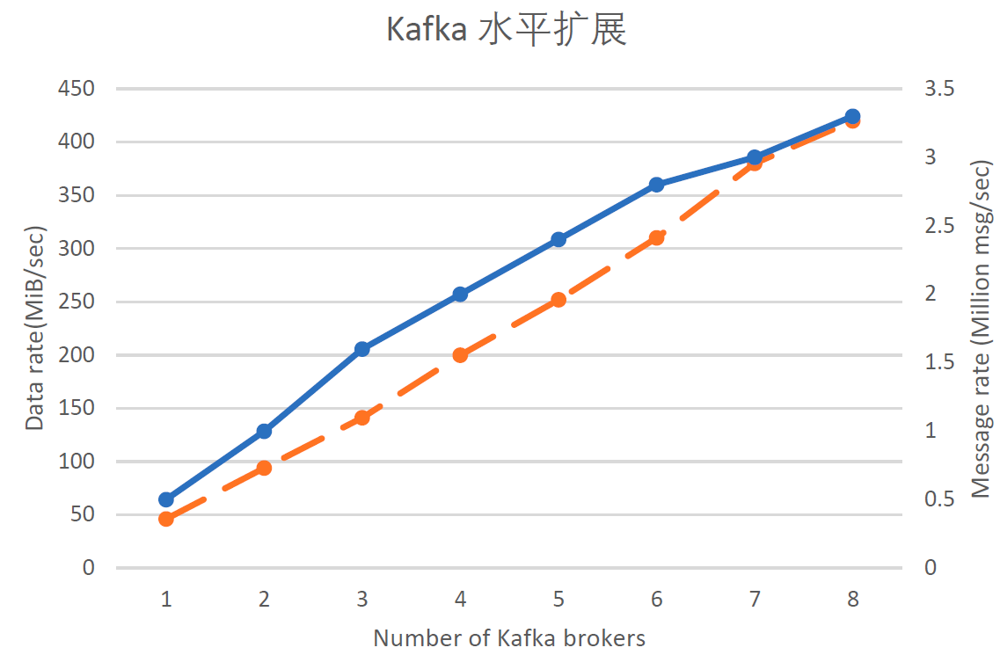

% 日志系统测试
# 日志系统测试

本章主要是针对前述的系统实现，对整个日志系统进行功能测试和性能测试。测试各个组件的工作性能，集成后的整体效果，各个API的工作情况，前端展示和使用等各方面的功能，并发现其中可能存在的问题，或者需要优化的技术问题，对整体细节方面进行完善。

## 测试环境

本节首先对软硬件配置进行介绍。

### 软件环境

日志系统作为MSCP平台的一部分存在，MSCP平台各模块所用到的与本系统相关的软件如下：

<table>
<tr><th>模块</th><th>软件</th><th>版本</th></tr>
<tr><td rowspan="2">MSCP</td><td>kubernetes</td><td>1.5.3</td></tr>
<tr><td>flannel</td><td>v0.9.0-rc1</td></tr>
<tr><td rowspan="2">portal</td><td>beego</td><td>1.9.0</td></tr>
<tr><td>angularJS</td><td>1.6.2</td></tr>
<tr><td rowspan="1">存储</td><td>ceph</td><td>11.2.0</td></tr>
<tr><td rowspan="7">日志</td><td>ElasticSearch</td><td>5.2.2</td></tr>
<tr><td>Logstash</td><td>5.2.2</td></tr>
<tr><td>kibana</td><td>5.2.2</td></tr>
<tr><td>journalBeat</td><td>5.2.2</td></tr>
<tr><td>fileBeat</td><td>5.2.2</td></tr>
<tr><td>kafka</td><td>0.10.1.0</td></tr>
<tr><td>zookeeper</td><td>3.4.9</td></tr>
</table>


### 硬件环境

受测试环境限制本测试在单region环境下进行。该region中有一个运行了ElasticSearch集群和其他MSCP系统组件的admin zone和15个运行模拟用户负载的worker zone。admin zone由三台28核56线程，256GiB内存，拥有SSD存储的高性能服务器构成。每个worker zone分别由20台来自于云计算提供商的4核4线程，8GiB内存的KVM虚拟机构成。整个测试平台共有203台计算节点可用。实际测试时系统实际可用的计算节点数在183-195之间波动。

## 系统安装

### 安装ES集群（文件位于./kafka/elasticsearch）
以下操作在Namespace ELK中进行
#### 导入configmap
```
    kubectl --namespace=elk create -f elasticsearch-config.yaml
```
#### 创建service
```
    kubectl --namespace=elk create -f es-discovery-service.yaml
    kubectl --namespace=elk create -f es-service.yaml
```
#### 部署容器

1. 部署master节点
```
    kubectl --namespace=elk create -f es-master-deployment.yaml
```
可将rep数量改到1，内存（ES_JAVA_OPTS环境变量）改到2GiB（不可低于1GiB）

2. 部署client节点
```
    kubectl --namespace=elk create -f es-client-deployment.yaml
```
可将rep数量改到1，内存改到2GiB（不可低于1GiB）

3. 部署data节点
在部署data节点前请保证master和client节点均已部署完成，可用
`curl -s http://elasticsearch:9200/_cluster/health `检查"number_of_nodes"是否和client+master数量一致，number_of_data_nodes是否为0
```
kubectl --namespace=elk create -f es-data-deployment.yaml
```
可将rep数量改到2，内存改到6GiB（不可低于2GiB）

### 部署kafka（文件位于./kafka/kafka）

1. 部署zookeeper
```
kubectl --namespace=elk create -f zookeeper.yaml
```
2. 部署kafka
```
kubectl --namespace=elk create -f kafka.yaml
```

### 部署logstash（文件位于./kafka/logstash）
1. 导入configmap
```
    kubectl --namespace=elk create -f logstash-config.yaml
    kubectl --namespace=elk create -f logstash-ship/logstash-pipline-config-ship.yaml
    kubectl --namespace=elk create -f logstash-direct/logstash-pipeline-direct-config.yaml
```
这里请检查hosts => "http://elasticsearch.elk.svc.cluster.local:9200"一行是否合适，此处应指向ES API。
    
2. 建立service    
```
    kubectl --namespace=elk create -f logstash-service.yaml
```
3. 建立容器
rep数量均可降为1
* Logstash for container logs 
```
    kubectl --namespace=elk create -f logstash-container/logstash-deployment.yaml
```
* Logstash for app log files
```
    kubectl --namespace=elk create -f logstash-app/logstash-deployment-app.yaml
```
* Logstash shipper
用于从kafka中向ES搬运数据
```
    kubectl --namespace=elk create -f logstash-ship/logstash-ship-deployment.yaml
```

### 部署Beats（文件位于./kafka/beats）

1. JournalBeat
```
    kubectl --namespace=elk create -f journalbeat-container-config.yaml
    kubectl --namespace=elk create -f journalbeat-container.yaml
```
此处请将环境变量LOGSTASH_HOST的值和节点的IP相匹配
2. FileBeat
 ```
    kubectl --namespace=elk create -f filebeat-app.yaml
```
此处请将环境变量LOGSTASH_HOST的值和节点的IP相匹配

## 性能测试

### ElasticSearch性能测试

#### 测试方法

通过journalbeat和logstash不断以最大速度向ElasticSearch写入数据从而测试ElasticSearch的写入性能。数据来源是系统journald中积攒的系统日志。根据经验，journalBeat，logstash产生日志的速度大大高于ElasticSearch的落盘速度。

#### 测试基准

ElasticSearch 配置：
* 1个Master Node，JVM：heap size设置为2048MB 
* 1个Client Node，JVM：heap size设置为2048MB 
* 2个Data Node，JVM：heap size设置为2048MB 

Indice 配置：5分片1备份

基准数据：ElasticSearch落盘速度为172 Doc/s

对ElasticSearch Data节点的Log发现有大量超过1s 的full gc发生。进一步分析其gc log发现gc耗时大约占了总运行时间的40%（1267.59s/3786s）由此分析，我们认为系统的瓶颈在于ES Data的内存不足。

#### 纵向扩展
我们在维持Data节点数量为2不变的情况下提高JVM heap size测试结果如下



我们可以看到，随着数据Heap size的提高Elasticsearch集群的写入性能不断提高。

通过对Gc log的分析我们发现，在Heap size到达6Gb时gc耗时<10%（321.03s/3723s），运行过程中没有发生full gc， heap占用峰值被良好的控制在80%左右，平均Heap占用维持在3.7GiB左右。我们由此认为6GiB的Heap Size是一个合适的值。

在Heap size达到8GiB之后，虽然集群性能依然能得到少许提高，但是根据对Gc log的分析我们发现ElasticSearch Data节点对Heap的平均使用只有4GiB左右。我们认为这样的操作是得不偿失的。

#### 水平扩展 

在确定6GiB的Heap Size为合适值后我们尝试对ElasticSearch Data节点进行水平扩展，提高ElasticSearch Data节点的数量来提高性能。下图展示了我们的测试结果：

 

由上图可见在Data Node的个数达到5时集群性能有了大幅提升，我们认为这是由于分片的个数被设置为5造成的。根据Elastic.io提供的指南，Data节点的个数在被设置为分片数量的倍数时比较合适。所以在这里我们在安装脚本中将ElasticSearch Data 节点的个数默认设置为5。

#### 其他可以提高Log系统性能的方案
1.	降低log Document的大小，在我们的测试中Log Document的大小大约为2KiB其中包括了30种以上的属性。而log信息则包含在其中一个叫message的属性中。这样的Document效率比较低，可以考虑删除部分不会用到的属性。
2.	调整ElasticSearch中的Mapping设置对一些字段不进行分词等操作，降低集群的压力。
3.	调整ElasticSearch中分片和备份的数量，降低备份数量有利于提高性能但是ElasticSearch集群将会丧失节点失效时自动恢复和Scale In的能力。
4.	在Logstash和ElasticSearch集群中加入Message queue。

### Kafka性能测试
#### 测试方法

利用kafka自身提供的性能测试工具和grafana可视化平台测试kafka集群的能力。
#### 硬件配置

* 集群服务器数量：8
* CPU核数：8
* RAM数量：32G
* 磁盘：200GB机械磁盘

#### 测试场景规划

* 最大消息数：270Million
* 最大总数据量：42GB
* 总计运行时间：120s
* 最大Broker数：8
* 客户端最大线程数：9

#### 测试结果

在每条消息1KiByte的场景下最大每秒消息数达到了大约3.3Million Msg/Sec，数据吞吐率最高达到了420MiB/Sec.

#### 水平扩展测试

我们同时测试了kafka集群的水平扩展能力。在增加broker数量的情况下kafka的数据吞吐能力得到了明显提高。

 

## 功能测试
### Journald中的日志收集

<table>
  <tr>
    <td>测试项目：</td>
    <td>日志收集</td>
  </tr>
  <tr>
    <td>测试分项：</td>
    <td>Journald中的日志收集</td>
  </tr>
  <tr>
    <td>测试目的：</td>
    <td>测试日志系统是否能够顺利收集journald中的日志</td>
  </tr>
  <tr>
    <td>预置条件：</td>
    <td>日志系统部署完毕，运行正常。journalbeat已经安装部署</td>
  </tr>
  <tr>
    <td>测试步骤：</td>
    <td>1）改变logstash中的配置，使之将日志处理状态通过console显示出来</p>
    2）部署作为监控用途的kibana服务</p>
    3）重新启动journalbeat容器</p>
    4）查看日志收集情况
    </td>
  </tr>
  <tr>
    <td>预期结果：</td>
    <td>1）journalbeat的console中有关于日志收集和发送的信息</p>
    2）logstash中的console中能够查询到关于日志收集和发送的信息</p>
    3）kibana中能够看到收集到的日志</p>
    </td>
  </tr>
  <tr>
    <td>测试结果：</td>
    <td>Pass</td>
  </tr>
</table>

### Logfile中的日志收集

<table>
  <tr>
    <td>测试项目：</td>
    <td>日志收集</td>
  </tr>
  <tr>
    <td>测试分项：</td>
    <td>日志文件中的日志收集</td>
  </tr>
  <tr>
    <td>测试目的：</td>
    <td>测试日志系统是否能够顺利收集日志文件中的日志</td>
  </tr>
  <tr>
    <td>预置条件：</td>
    <td>日志系统部署完毕，运行正常。filebeat已经安装部署</td>
  </tr>
  <tr>
    <td>测试步骤：</td>
    <td>1）改变logstash中的配置，使之将日志处理状态通过console显示出来</p>
    2）部署作为监控用途的kibana服务</p>
    3）部署一个测试用应用</p>
    4）查看日志收集情况</p>
    </td>
  </tr>
  <tr>
    <td>预期结果：</td>
    <td>1）filebeat的console中有关于日志收集和发送的信息</p>
    2）logstash中的console中能够查询到关于日志收集和发送的信息</p>
    3）kibana中能够看到收集到的日志</p>
    </td>
  </tr>
  <tr>
    <td>测试结果：</td>
    <td>Pass</td>
  </tr>
</table>

### 日志推送

<table>
  <tr>
    <td>测试项目：</td>
    <td>日志收集</td>
  </tr>
  <tr>
    <td>测试分项：</td>
    <td>日志推送接口日志收集</td>
  </tr>
  <tr>
    <td>测试目的：</td>
    <td>测试日志系统是否能够顺利收集来自日志推送接口的日志</td>
  </tr>
  <tr>
    <td>预置条件：</td>
    <td>日志系统部署完毕，运行正常。日志推送接口API Server已经安装部署</td>
  </tr>
  <tr>
    <td>测试步骤：</td>
    <td>
    1）部署作为监控用途的kibana服务</p>
    2）部署一个测试用应用，该应用会定时向日志推送接口推送日志</p>
    3）查看日志收集情况</p>
    </td>
  </tr>
  <tr>
    <td>预期结果：</td>
    <td>1）API Server的console中有关于日志收集和发送的信息</p>
    3）kibana中能够看到收集到的日志</p>
    </td>
  </tr>
  <tr>
    <td>测试结果：</td>
    <td>Pass</td>
  </tr>
</table>

<table>
  <tr>
    <td>测试项目：</td>
    <td>日志收集</td>
  </tr>
  <tr>
    <td>测试分项：</td>
    <td>日志推送接口日志格式验证</td>
  </tr>
  <tr>
    <td>测试目的：</td>
    <td>测试日志系统是否能够验证日志推送接口的日志的格式</td>
  </tr>
  <tr>
    <td>预置条件：</td>
    <td>日志系统部署完毕，运行正常。日志推送接口API Server已经安装部署</td>
  </tr>
  <tr>
    <td>测试步骤：</td>
    <td>
    1）部署作为监控用途的kibana服务</p>
    2）部署一个测试用应用，该应用会定时向日志推送接口推送日志，但是其中缺少timestemp信息</p>
    3）查看日志收集情况</p>
    </td>
  </tr>
  <tr>
    <td>预期结果：</td>
    <td>1）API Server的console中有关于拒绝日志转发信息</p>
    </td>
  </tr>
  <tr>
    <td>测试结果：</td>
    <td>Pass</td>
  </tr>
</table>

### 日志批量写入
<table>
  <tr>
    <td>测试项目：</td>
    <td>日志收集</td>
  </tr>
  <tr>
    <td>测试分项：</td>
    <td>日志推送接口批量日志收集</td>
  </tr>
  <tr>
    <td>测试目的：</td>
    <td>测试日志系统是否能够顺利收集来自日志推送接口的批量日志</td>
  </tr>
  <tr>
    <td>预置条件：</td>
    <td>日志系统部署完毕，运行正常。日志推送接口API Server已经安装部署</td>
  </tr>
  <tr>
    <td>测试步骤：</td>
    <td>
    1）部署作为监控用途的kibana服务</p>
    2）部署一个测试用应用，该应用会定时向日志推送接口批量推送日志</p>
    3）查看日志收集情况</p>
    </td>
  </tr>
  <tr>
    <td>预期结果：</td>
    <td>1）API Server的console中有关于日志收集和发送的信息</p>
    3）kibana中能够看到收集到的日志</p>
    </td>
  </tr>
  <tr>
    <td>测试结果：</td>
    <td>Pass</td>
  </tr>
</table>

### 日志查询

<table>
  <tr>
    <td>测试项目：</td>
    <td>日志查询</td>
  </tr>
  <tr>
    <td>测试分项：</td>
    <td>日志查询API</td>
  </tr>
  <tr>
    <td>测试目的：</td>
    <td>测试日志系统是否能够顺利根据查询条件返回结果</td>
  </tr>
  <tr>
    <td>预置条件：</td>
    <td>日志系统部署完毕，运行正常。</td>
  </tr>
  <tr>
    <td>测试步骤：</td>
    <td>
    1）通过API查询某应用的所有日志</p>
    2）通过API查询某应用某时间段内的所有日志</p>
    3）通过API查询某应用某时间段内日志条数按时间的直方图</p>
    4）查询某不存在应用的日志</p>
    </td>
  </tr>
  <tr>
    <td>预期结果：</td>
    <td>
    1）步骤一查询到某应用的所有日志</p>
    2）步骤二查询到某应用某时间段内的所有日志</p>
    3）步骤三查询到某应用某时间段内日志条数按时间的直方图</p>
    4）步骤四返回空数据集</p>
    </td>
  </tr>
  <tr>
    <td>测试结果：</td>
    <td>Pass</td>
  </tr>
</table>


### 用户token签发

<table>
  <tr>
    <td>测试项目：</td>
    <td>鉴权系统</td>
  </tr>
  <tr>
    <td>测试分项：</td>
    <td>token签发</td>
  </tr>
  <tr>
    <td>测试目的：</td>
    <td>测试鉴权系统是否能够按需求正确签发token</td>
  </tr>
  <tr>
    <td>预置条件：</td>
    <td>日志系统部署完毕，运行正常。</td>
  </tr>
  <tr>
    <td>测试步骤：</td>
    <td>
    1）使用正确的用户名密码请求签发根token</p>
    2）使用错误的用户名密码请求签发根token</p>
    3）使用正确的根token申请签发关于某应用的token</p>
    4）使用过期的根token申请签发关于某应用的token</p>
    5）使用正确的根token申请签发关于某不存在应用的token</p>
    </td>
  </tr>
  <tr>
    <td>预期结果：</td>
    <td>
    1）步骤一返回202 Accept和新token</p>
    2）步骤二返回403 Forbidden</p>
    3）步骤三返回202 Accept和新token</p>
    4）步骤四返回403 Forbidden</p>
    5）步骤五返回404 Not Found</p>
    </td>
  </tr>
  <tr>
    <td>测试结果：</td>
    <td>Pass</td>
  </tr>
</table>

### 用户隔离日志写入

<table>
  <tr>
    <td>测试项目：</td>
    <td>日志系统</td>
  </tr>
  <tr>
    <td>测试分项：</td>
    <td>日志推送接口的用户隔离</td>
  </tr>
  <tr>
    <td>测试目的：</td>
    <td>测试日志推送接口的用户隔离是否工作正常</td>
  </tr>
  <tr>
    <td>预置条件：</td>
    <td>日志系统部署完毕，运行正常。</td>
  </tr>
  <tr>
    <td>测试步骤：</td>
    <td>
    1）使用正确的token向日志推送接口推送数据</p>
    2）使用过期token向日志推送接口推送数据</p>
    3）不使用token向日志推送接口推送数据</p>
    4）向日志系统推送"appid"和token中access字段不一致的数据</p>
    5）推送关于某不存在应用的日志数据</p>
    </td>
  </tr>
  <tr>
    <td>预期结果：</td>
    <td>
    1）步骤一返回202 Accept</p>
    2）步骤二返回403 Forbidden</p>
    3）步骤三返回401 Unauthorized</p>
    4）步骤四返回403 Forbidden</p>
    5）步骤五返回404 Not Found</p>
    </td>
  </tr>
  <tr>
    <td>测试结果：</td>
    <td>Pass</td>
  </tr>
</table>

### 用户隔离日志读取

<table>
  <tr>
    <td>测试项目：</td>
    <td>日志系统</td>
  </tr>
  <tr>
    <td>测试分项：</td>
    <td>日志推送接口的用户隔离</td>
  </tr>
  <tr>
    <td>测试目的：</td>
    <td>测试日志推送接口的用户隔离是否工作正常</td>
  </tr>
  <tr>
    <td>预置条件：</td>
    <td>日志系统部署完毕，运行正常。</td>
  </tr>
  <tr>
    <td>测试步骤：</td>
    <td>
    1）使用正确的token查询某应用的日志数据</p>
    2）使用过期token查询某应用的日志数据</p>
    3）不使用token查询某应用的日志数据</p>
    4）查询"appid"和token中access的应用的日志数据</p>
    5）查询某不存在应用的日志数据</p>
    </td>
  </tr>
  <tr>
    <td>预期结果：</td>
    <td>
    1）步骤一返回200 OK和日志数据</p>
    2）步骤二返回403 Forbidden</p>
    3）步骤三返回401 Unauthorized</p>
    4）步骤四返回403 Forbidden</p>
    5）步骤五返回404 Not Found</p>
    </td>
  </tr>
  <tr>
    <td>测试结果：</td>
    <td>Pass</td>
  </tr>
</table>

## 其他测试

此节我们将对日志系统其它方面的测试进行介绍，其中主要是高可用测试和对kafka的水平扩展测试。由于对ElasticSearch的水平扩展测试已在上文"性能测试"一节中加以阐述，所以在此不再重复。

### 高可用测试

当日志系统因网络或机器原因导致部分服务无法达到计划的规模时，整体的服务不应中断。待服务恢复后，恢复的节点应当被重新加入到集群之中。

<table>
  <tr>
    <td>测试项目：</td>
    <td>日志系统</td>
  </tr>
  <tr>
    <td>测试分项：</td>
    <td>日志系统高可用测试</td>
  </tr>
  <tr>
    <td>测试目的：</td>
    <td>测试日志系统部分失效后的自我恢复能力</td>
  </tr>
  <tr>
    <td>预置条件：</td>
    <td>日志系统部署完毕，运行正常。</td>
  </tr>
  <tr>
    <td>测试步骤：</td>
    <td>
    1）通过日志系统管理API降低ElasticSearch的data节点数量，使得集群中部分节点被停止</p>
    2）通过日志系统管理API降低kafka的broker数量，使得集群中部分节点被停止</p>
    3）过一段时间恢复以上步骤中关掉的节点</p>
    </td>
  </tr>
  <tr>
    <td>预期结果：</td>
    <td>
    1）步骤一结束后通过日志系统管理API检查日志系统状态可以看到状态由green变为yellow。ElasticSearch中的索引重新分配。一段时间后状态变回green。</p>
    2）步骤二结束后通过日志系统管理API检查日志系统状态可以看到kafka broker的数目降低。</p>
    3）步骤三结束后通过日志系统管理API检查日志系统状态可以看到kafka broker和ElasticSearch data节点的数量恢复。ElasticSearch中的索引重新分配。</p>
    </td>
  </tr>
  <tr>
    <td>测试结果：</td>
    <td>Pass</td>
  </tr>
</table>

### kafka水平扩展测试

<table>
  <tr>
    <td>测试项目：</td>
    <td>kafka集群</td>
  </tr>
  <tr>
    <td>测试分项：</td>
    <td>kafka水平扩展测试</td>
  </tr>
  <tr>
    <td>测试目的：</td>
    <td>测试kafka水平扩展能力</td>
  </tr>
  <tr>
    <td>预置条件：</td>
    <td>日志系统部署完毕，运行正常。</td>
  </tr>
  <tr>
    <td>测试步骤：</td>
    <td>
    1）通过日志系统管理API提高kafka broker的数量</p>
    </td>
  </tr>
  <tr>
    <td>预期结果：</td>
    <td>
    1）通过日志系统管理API检查日志系统状态可以看到kafka broker数量提高</p>
    2）通过kafka cli发现新节点加入集群</p>
    </td>
  </tr>
  <tr>
    <td>测试结果：</td>
    <td>Pass</td>
  </tr>
</table>

# 本章小结

本章对日志系统的主要功能进行了测试的设计，阐述了测试所用的环境和测试用例的步骤设计。除了测试了日志系统各个接口和功能，还测试了系统的性能，可扩展性，高可用性等诸多方面。

测试结果表明，本课题实现的日志系统，提供了高吞吐的数据收集，存储，分析，查询等能力。同时提供了友好的用户界面。符合各项既定要求。