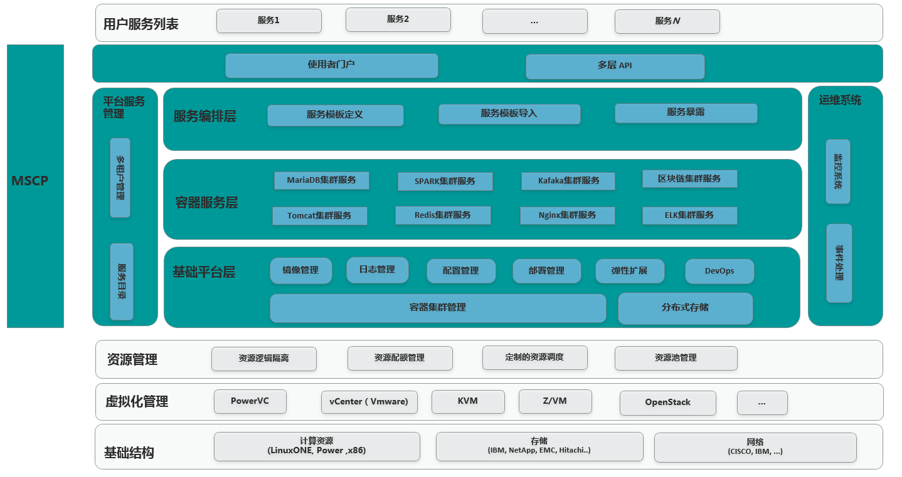
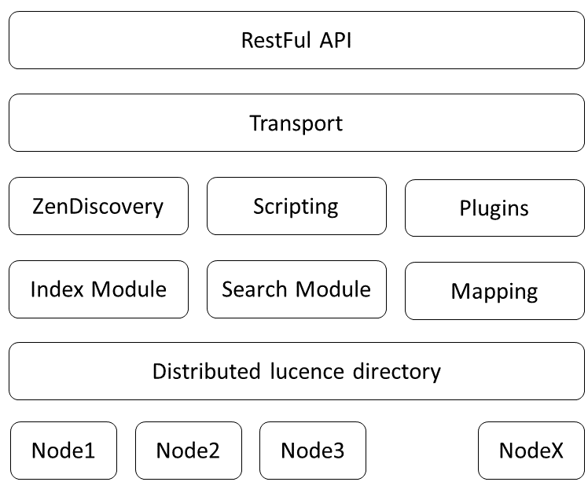

基于ELK 的微服务日志管理系统在的设计与实现
#绪论
## 研究背景和意义
## 国内外研究现状
## 研究工作主要内容
## 论文组织架构
# 微服务日志管理技术概述
## 日志管理系统概述
## 微服务云平台
### kubernetes
### MSCP系统架构
### MSCP平台日志特点和需求
## 日志管理平台
日志是计算机系统同维护人员以及开发人员交流的重要途径。特别是对于现代互联网应用系统来说，每小时产出数以万计的日志。这些日志中记录了对系统操作大量一般或是异常信息，比如系统工作过程中的关键的操作记录，软硬件错误或是异常信息，用户对系统更改的操作记录等。这些信息不仅仅给开发，运维人员提供了维护的依据，更能够挖掘出如用户特征，行为习惯，关注热点等诸多更深层次的信息。可以说，现代信息系统的日志是企业用户的数据金矿。日志管理就是通过对不同来源的日志统一收集，处理，储存，展示，方便用户从中提取有用的信息。
目前，在市面上已经有了许多开源或是商业的日志管理解决方案，每一个系统管理员也都会有自己管理日志的独特方案。最简单的，系统管理员可以通过shell，python等脚本语言过滤，处理和分析，利用Linux系统自身的特性管理日志数据的生命周期。这种简单有效的方式得到了许多开发者和管理员的青睐。但是这种简单的方式有着显而易见的局限性，那就是只能处理部署在单个服务器上个的单个应用产生的日志。对于微服务化应用产生的高度分散的日志无法有效地处理。当然，目前亦有许多成熟的日志分析工具，如Awstats，Webalizer等等就是专门为分析日志而生的。同时，百度，谷歌等公司亦提供了一些在线工具可以用于对日志的分析。但是这些工具虽然拥有出众的分析能力但是却无法和我们的微服务平台相集成，同时由于这些工具都无法实现集群化部署，其性能无法满足微服务云平台的需求。另外，在信息安全越来越受重视的当下，企业用户并不愿意将包含有自己业务信息的日志上传到公用服务器上进行处理。面对部署在由数百台服务器构成的微服务平台上，短生命周期的数以千计的微服务产生的每秒万条以上的日志，以及企业级应用对日志管理的特殊需求，这些传统的解决方案都已难以满足需求。
对日志分析应用来说，其处理的数据规模十分庞大。在这个移动互联网高速发展的时代，数据的规模高速扩张，一个应用可能要服务于数以万计的用户，而一个终端用户可能在一天内进行数十次交易，单单一次交易便能够生成数十条日志记录。这样的服务只能由运行在云平台上的微服务化的应用来实现。
在云平台上的应用数量众多种类各异，不仅要求运行日志管理服务拥有可靠的日志存储能力，同时还要能够高性能地接受来自分布式应用的日志数据。此外，用户往往还要求云平台的日志管理服务能够提供一定的日志分析和报警功能。这些日志数据直接来自于用户应用，起结构往往只有应用开发者自己能够理解，从而无法被有效地保存到传统的结构化数据库中，我们的日志系统需要将这些非结构化的数据尽可能地保存下来。为了满足这些需求，我们的日志系统应当能够实现如下的功能：
对用户应用零入侵
* 通用的应用程序接口（api）
* 覆盖常见日志形式的日志收集器
* 允许用户自行开发日志收集组件并且接入我们云服务系统
* 用户，租户间数据隔离
* 高效的数据查询和过滤接口，同时和至少和某一种流行的查询方式相兼容
* 日志服务能够实现分散部署，高可用，可扩展
* 多数据中心的数据能够统一查询
* 日志数据能够提供热备份
### Elastic stack
### Journald
## 本章小结
#日志系统设计
## 需求分析
##日志系统云平台层设计
MSCP微服务云平台的整体架构如下图所示

在MSCP平台上，每个zone对应着一个kubernetes集群，这个集群一般被安置在同一个服务器机房的内部；而同一个region中的各个不同zone一般部署在同一个数据中心内部，其间一般由高速网络相连接（一般有多个千兆网络）。而region一般对应用户部署在不同地理位置上的数据中心，如用户的北京数据中心，纽约数据中心等等。其间一般通过公用网络相连接，这些链接一般容量不足，同时价格昂贵，无法支持大量日志数据的传输需求。针对以上情况我们对日志系统在云平台上的部署作了如下图的规划：

每个region拥有自己的ElasticSearch数据库集群，该集群与MSCP平台的其他基础组件一同被安装在一个被称为Admin zone的kubernetes集群之中。用户无法在此zone中部署自己的应用。这样的设计保证了MSCP平台的稳定性和用户体验。同一个region中的日志收集器和分析器均将数据发送到region中的ElasticSearch中。而日志查询API Server能够根据用户查询的不同从不同的数据源中查询日志数据。
##日志系统总体架构设计
日志系统架构如下图所示：
* 数据收集组件：日志收集器，HTTP Restful API接口
* 数据清洗组件：logstash分析器
* 数据缓存组件：高速消息队列缓存kafka
* 数据存储组件：ElasticSearch
* 数据查询和集群管理组件：数据查询和集群管理API Server
* 前端UI

数据收集组件从docker容器内部收集包括stdout/stderr，日志文件等在内的日志数据，并且开放HTTP API接口以供用户应用直接推送日志数据。该API接口能够通过分析数据来源自动将这些数据归入某用户名下从而实现数据隔离。logstash分析器对来自各个数据源的数据进行清洗，删除一些不需要的字段，同时对数据来源作分析，形成半结构化的数据，传递给高速缓存kafka。由于logstash作为无状态的服务，可以几乎无限地水平扩展，其性能往往远远超过ElasticSearch落盘的性能。Kafka高速缓存可以有效地将到达的数据缓存起来，等待ElasticSearch空闲时再将数据落盘。这样的设计一方面挡住了高并发的访问减少了日志数据落盘时的阻塞，另一方面有效地利用了ElasticSearch的性能。作为MSCP平台API接口的一部分，日志服务也提供了restful的API接口，通过该接口能够查询和管理日志服务的状态，同时其查询接口兼容ElasticSearch查询语法。这个API接口也能够和MSCP云平台的role based access control相配合有效地对用户数据进行隔离。在MSCP前端页面上我们提供了一个前端页面，用户可以方便地通过这个页面查询自己应用的日志；管理员用户还可以管理和查询日志服务的状态。下面详细说明各个组件的设计方案。
##日志系统各组件设计
### 数据收集组件
日志收集组件主要由两个部分构成，日志文件收集器和HTTP API接口。
日志收集器收集docker容器中的应用发送到控制台以及日志文件中的日志。这也是应用最常见的日志记录方式。通过这种方式收集日志不需要用户对自己的应用作出任何更改，做到了对用户应用的零入侵。对于容器化应用来说，其最佳实践是将所有日志发送到控制台，所以采集这些日志实际也是最重要的部分。对于这部分日志我们将其重定向到系统中的journald服务之中然后通过部署在每一台计算节点上的收集器统一发送到日志服务之中。另外，传统上应用开发者一般会选择将各种不同的日志，如服务器日志，系统日志，业务日志等输出到不同的文件之中分别保存。对于这一部分日志我们将其挂载到容器外部，从而暴露给负责收集日志文件的收集器，完成收集工作。
此外我们还提供了一个HTTP API接口以供愿意修改自己应用，或者是有特殊需求的用户直接通过push的方法向我们的日志系统直接发送日志数据。通过这个API充分考虑到了用户自定义日志数据结构的需求。用户除了可以向我们的系统提交日志文本和时间戳以外，还可以以key-value的方式描述一些自定义的字段，从而大大丰富了日志可以描述的数据。考虑到HTTP协议是一个比较“重”的协议，其链接建立，断开以及头部都需要消耗额外的资源，而日志数据一般较短这样就造成了数据传输效率低下的问题。为此我们的HTTP API还提供了批量写入的功能。一个HTTP请求可以包含多个日志数据。
###数据清洗组件
该组件主要负责对日志的数据进行清洗，为了能够在云服务平台上实现用户间的数据隔离并且保证用户查询的结果真实可信，我们通过建立Logstash服务（在日志系统中被称为phaser）对日志数据进行加工处理。来自于不同源头的日志数据会由不同的phaser服务进行处理，通过对特定字段进行切分，类型转换，字段重命名等操作，原始的来源不同的日志数据被统一转换为符合设计结构的数据项。同时这个过程中，一些对日志系统来说价值较低或者重复的数据项目，如在有微秒级时间戳和毫秒级时间戳的情况下我们仅保留微秒级时间戳，而诸如系统版本，进程ID，进程优先级等字段在这个过程中将被删除。而对于来自API Server的日志数据来说，数据清洗组件也能够过滤掉不符合系统要求的日志存储请求。这一过程降低了ElasticSearch需要分析和持久化的数据量，从结果上提高了系统的性能。在完成数据清洗之后，该组件将会将日志数据传递给数据缓存组件。
###数据缓存组件
日志数据通常是短文本数据，其尺寸一般很小，通常有效数据不会超过1KiB。而在一个生产系统上用户应用每秒就可能产生数以千计的日志数据。这样的业务特点要求我们的数据缓存组件能够拥有很高的数据吞吐和处理并发请求的能力。Apache Kafka是由Java和Scala编写的开源流处理平台。它提供了一个统一，高吞吐量，低延迟平台来处理实时数据流。它十分适合用于实现一个大规模，可扩展的消息队列。我们将其集成到日志系统之中并通过第二个logstash服务（在日志系统中被称为shipper）将kafka中缓存的数据“运输”到ElasticSearch之中。
####kafka。。。。
###数据存储组件
数据存储组件主要由ElasticSearch数据库实现，这也是本系统中最为核心的部分。ElasticSearch是Elastic公司开发的基于Apache Lucene的开源搜索引擎服务器软件。它一方面可以作为一个拥有良好的写入性能的NoSQL数据库使用，另一方面拥有第一无二的强大的近似的实时全文搜索和分析能力。这样的能力使得用户能够对海量的数据进行复杂的查询。经过清洗的数据在被shipper服务输送到ElasticScarch中后，Elasticsearch会对这些数据建立索引，根据配置将数据分发到不同的分片上。同时，Elasticsearch也会对这些分片建立副本以降低结点失效时数据丢失的风险。这些分片和分片的副本会被平衡地分配到不同的数据节点上，从而降低了单节点的压力。这样的设计也为集群的建立提供了可能。当系统压力增加时，只需要将新的数据节点加入集群。整个集群的的性能便能够通过横向扩展几乎无限地扩张。
日志系统默认按日期建立索引，对于每天产生的新的数据利用当天日期取名。为了降低单个索引的压力，来自于各个不同主机的日志也会被安置到不同的索引之中。由于ElasticSearch对内存占用相当大，需要部署ElasticSearch的节点有较高的性能。为了不让ElasticSearch集群影响到用户应用的正常工作，我们选择将其部署到一个单独的Kubernetes集群之中。针对集群管理的需求，我们选择了自己开发自动伸缩工具来管理集群规模。同时利用一些第三方工具来实现对日志数据的冷热分离机制。当有ElasticSearch节点失效时，集群会自行利用副本中的数据来恢复改节点上的内容，同时将负载分配给其他节点，从而保证了节点失效不会造成数据丢失，这一特性在集群收缩过程中也扮演着重要角色。整个ElasticSearch集群内部架构如下图所示，用户的日志数据被分配到了集群中的各个节点中。在查询数据时，ElasticSearch集群将查询请求分配给相关数据所在的数据节点，这些节点分别进行查询统计，最后由主节点完成汇总将结果返回给用户。

###数据查询组件
## 架构对比分析
### 
## 日志收集和存储架构
## 日志查询设计
## 日志多租户隔离
## 日志查询接口层
## 本章小结
# 日志管理系统的设计和实现
## 需求分析
## 系统架构设计
## 数据处理流程
## 数据模型设计
### 原始日志数据
#### Docker容器中的Stdout/ Stderro
#### 应用日志文件
#### MSCP平台自身的日志
### 中间数据模型
### 数据存储模型
## 设计指标
## 数据转换
## （实时数据挖掘）
## 本章小结
# 实验测试结果和实际应用
## 性能测试
## 功能测试
## 用户反馈
## 本章小结
# 总结和展望
### 

