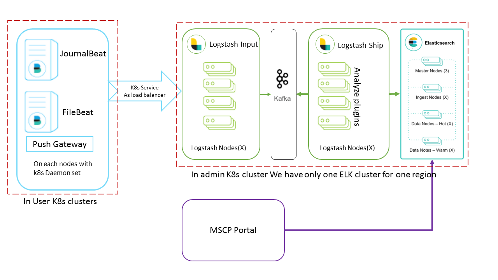
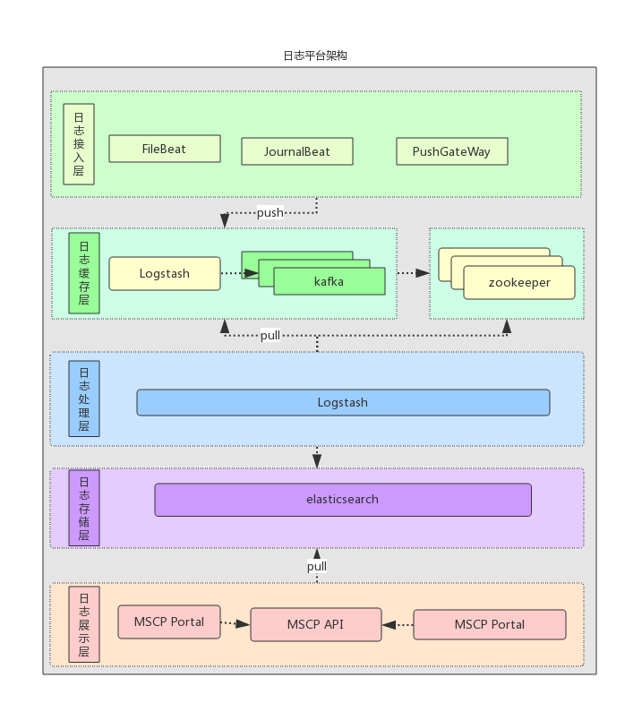

#日志系统设计
##日志系统云平台层设计
MSCP微服务云平台的整体架构如下图所示

在MSCP平台上，每个zone对应着一个kubernetes集群，这个集群一般被安置在同一个服务器机房的内部；而同一个region中的各个不同zone一般部署在同一个数据中心内部，其间一般由高速网络相连接（一般有多个千兆网络）。而region一般对应用户部署在不同地理位置上的数据中心，如用户的北京数据中心，纽约数据中心等等。其间一般通过公用网络相连接，这些链接一般容量不足，同时价格昂贵，无法支持大量日志数据的传输需求。针对以上情况我们对日志系统在云平台上的部署作了如下图的规划：

每个region拥有自己的ElasticSearch数据库集群，该集群与MSCP平台的其他基础组件一同被安装在一个被称为Admin zone的kubernetes集群之中。用户无法在此zone中部署自己的应用。这样的设计保证了MSCP平台的稳定性和用户体验。同一个region中的日志收集器和分析器均将数据发送到region中的ElasticSearch中。而日志查询API Server能够根据用户查询的不同从不同的数据源中查询日志数据。
##日志系统总体架构设计
日志系统架构如下图所示：
* 数据收集组件：日志收集器，HTTP Restful API接口
* 数据清洗组件：logstash分析器
* 数据缓存组件：高速消息队列缓存kafka
* 数据存储组件：ElasticSearch
* 数据查询组件：数据查询API Server
* 前端UI

数据收集组件从docker容器内部收集包括stdout/stderr，日志文件等在内的日志数据，并且开放HTTP API接口以供用户应用直接推送日志数据。该API接口能够通过分析数据来源自动将这些数据归入某用户名下从而实现数据隔离。logstash分析器对来自各个数据源的数据进行清洗，删除一些不需要的字段，同时对数据来源作分析，形成半结构化的数据，传递给高速缓存kafka。由于logstash作为无状态的服务，可以几乎无限地水平扩展，其性能往往远远超过ElasticSearch落盘的性能。Kafka高速缓存可以有效地将到达的数据缓存起来，等待ElasticSearch空闲时再将数据落盘。这样的设计一方面挡住了高并发的访问减少了日志数据落盘时的阻塞，另一方面有效地利用了ElasticSearch的性能。作为MSCP平台API接口的一部分，日志服务也提供了restful的API接口，该接口兼容ElasticSearch查询语法，同时背后的API Server能够有效地对用户数据进行隔离。在MSCP前端页面上我们也提供了一个前端页面，用户可以方便地通过这个页面查询自己应用的日志。下面详细说明各个组件的设计方案。
##日志系统各组件设计
###数据清洗组件
该组件主要负责对日志的数据进行清洗，为了能够在云服务平台上实现用户间的数据隔离并且保证用户查询的结果真实可信，我们通过建立Logstash服务（在日志系统中被称为phaser）对日志数据进行加工处理。来自于不同源头的日志数据会由不同的phaser服务进行处理，通过对特定字段进行切分，类型转换，字段重命名等操作，原始的来源不同的日志数据被统一转换为符合设计结构的数据项。同时这个过程中，一些对日志系统来说价值较低或者重复的数据项目，如在有微秒级时间戳和毫秒级时间戳的情况下我们仅保留微秒级时间戳，而诸如系统版本，进程ID，进程优先级等字段在这个过程中将被删除。而对于来自API Server的日志数据来说，数据清洗组件也能够过滤掉不符合系统要求的日志存储请求。这一过程降低了ElasticSearch需要分析和持久化的数据量，从结果上提高了系统的性能。在完成数据清洗之后，该组件将会将日志数据传递给数据缓存组件。
###数据缓存组件
日志数据通常是短文本数据，其尺寸一般很小，通常有效数据不会超过1KiB。而在一个生产系统上用户应用每秒就可能产生数以千计的日志数据。这样的业务特点要求我们的数据缓存组件能够拥有很高的数据吞吐和处理并发请求的能力。Apache Kafka是由Java和Scala编写的开源流处理平台。它提供了一个统一，高吞吐量，低延迟平台来处理实时数据流。它十分适合用于实现一个大规模，可扩展的消息队列。我们将其集成到日志系统之中并通过第二个logstash服务（在日志系统中被称为shipper）将kafka中缓存的数据“运输”到ElasticSearch之中。
####kafka。。。。
###数据存储组件
数据存储组件主要由ElasticSearch数据库实现，这也是本系统中最为核心的部分。ElasticSearch是Elastic公司开发的基于Apache Lucene的开源搜索引擎服务器软件。它一方面可以作为一个拥有良好的写入性能的NoSQL数据库使用，另一方面拥有第一无二的强大的近似的实时全文搜索和分析能力。这样的能力使得用户能够对海量的数据进行复杂的查询。经过清洗的数据在被shipper服务输送到ElasticScarch中后，Elasticsearch会对这些数据建立索引，根据配置将数据分发到不同的分片上。同时，Elasticsearch也会对这些分片建立副本以降低结点失效时数据丢失的风险。这些分片和分片的副本会被平衡地分配到不同的数据节点上，从而降低单节点的压力。这样的设计也为集群的建立提供了可能。当需求增加时，整个集群的横向 扩展能力也是本系统的一大特色，实时将新增设备假如到集群，简单配置便能使 用。 本系统默认为按天建立索引，对每天的数据用当天日期取名，将所有数据存 储在该索引中，由于ElasticSearch对内存的占用很大，需要设备的物理内存的大 小要能满足，由于数据量上不会太大，ElastieSearch不需要进行很大的性能调优， 针对特定需求，可以选择开发或者直接使用己有的第三方插件。对集群节点数量 采用奇数设置，当有设备宕机时，会选举出新的主节点继续工作，由于采用了副 本机制，宕机设备上的数据不会丢失，剩下的设备会进行数据的再次分配。整个 检索模块内部的结构如图3-5所示，外部查询信息时，ElasticSearch集群内部是 将检索的数据分布在各个节点上，这时会分别进行统计，然后将最后结果返同给 查询者。
